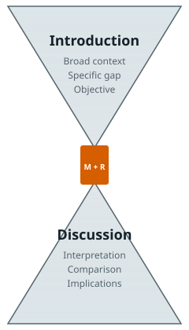

# The structure of a scientific article

Most scientific articles follow the IMRAD format: Introduction, Methods, Results, and Discussion [@sollaci2004imrad]. This structure is not arbitrary. It mirrors the logic of an investigation: *Why did you do it? How did you do it? What did you find? What does it mean?*

## The hourglass model

{width=320 fig-align="center" fig-alt="Diagram of an hourglass: a wide top labelled introduction narrows to a central objective, a narrow waist holds methods and results, then widens again into the discussion."}

A useful way to think about an article's narrative arc is the hourglass. The introduction starts broad (the general problem), narrows to the specific research question, and states the objective. The methods and results stay narrow and specific. The discussion then broadens again, from interpretation of the specific findings to their wider implications. The abstract compresses this entire arc into a single paragraph.

A concrete example of the arc. The opening sentence of the introduction might be *"Heart failure affects more than 60 million people worldwide and is a leading cause of hospital readmission."* By the end of the introduction, this has narrowed to *"We assessed whether N-terminal pro-B-type natriuretic peptide (NT-proBNP) at discharge predicts 30-day readmission in patients hospitalised for acute heart failure."* The methods and results stay at that level of specificity. The discussion then widens again: *"These findings support risk-stratified discharge planning in acute heart failure, a population in which 30-day readmissions account for a large share of avoidable hospital use."*

::: {.column-margin}
**The example cohort.** NT-proBNP is a blood marker that rises when the heart is under strain. Thirty-day readmission after a heart failure hospitalisation matters because it affects roughly one in five patients and is often preventable with targeted follow-up. The 5,204-patient cohort used throughout Part I is simulated; all findings are fictional but clinically plausible. The simulation script and a full schema are at [`figures/sw_cohort.py`](https://github.com/tiagojct/working-draft/blob/main/figures/sw_cohort.py).
:::

Not every discipline uses IMRAD. Qualitative research articles in the social sciences often replace "Results" with "Findings" and dedicate more space to theoretical framing in the introduction. Engineering papers may include a "System Design" section. Short communications in high-impact journals compress everything into a few hundred words. The underlying logic, however, is the same: context, question, method, answer, significance.

::: {.column-margin}
If your discipline or target journal uses a non-standard structure, adapt the hourglass proportionally rather than abandoning the logic entirely. Readers still need context, a specific question, a clear method, a direct answer, and an honest discussion of what it means.
:::

## The introduction

The introduction is a funnel: broad context, narrower gap, specific question, clear objective. Four paragraphs is often enough.

1. **Paragraph 1.** State the general problem and why it matters: burden of disease, cost, clinical relevance.
2. **Paragraph 2.** Summarise what is already known. Group similar findings, cite primary sources where possible, and avoid a chronological "review of the literature" that does not move toward a question.
3. **Paragraph 3.** Identify the specific gap or unresolved question. This is the most important paragraph. If a reader finishes it and cannot state what the study is about, the introduction has failed.
4. **Paragraph 4.** State the objective precisely, in one sentence. If relevant, state the hypothesis and the study design.

Two common failure modes. The first is reviewing the field without arriving at a specific question. The second is introducing the findings in paragraph 4; those belong in the results.

## Methods

Another team should be able to replicate your study from the methods section alone. Order the section by study logic:

1. **Design and setting.** Study design (cohort, case-control, randomised trial), setting (hospital, clinic, registry), and recruitment dates.
2. **Participants.** Inclusion and exclusion criteria, how participants were identified, and how they were sampled.
3. **Variables.** Primary outcome, secondary outcomes, predictors, and potential confounders. For each: how it was measured, at what time, and by whom.
4. **Data sources.** Chart review, registry extraction, questionnaires. Quality checks and missingness rules.
5. **Statistical analysis.** Descriptive statistics, the primary model, missing-data handling, sample-size justification, and any sensitivity analyses.
6. **Ethics.** Approving committee and reference number, consent procedure, and registration number if applicable.

If the study follows a reporting guideline, say so in the first sentence: *"This cohort study is reported in accordance with the STROBE statement."* Put the filled checklist in the supplement.

## Results

Describe; do not interpret. Report the numbers in the same order the questions appear in the introduction: recruitment and baseline first, primary outcome next, secondary outcomes, then sensitivity analyses.

Three rules avoid most problems:

- **One paragraph per table or figure.** Introduce the table, describe its message in one or two sentences, highlight the numbers that matter most, and move on.
- **Estimate + 95% CI + p-value, in that order.** Not a p-value alone.
- **No interpretation.** "We found X" belongs in the results; "this suggests Y" belongs in the discussion.

::: {.column-margin}
Choosing the right chart type and avoiding common visual errors are covered in Chapter 4 (Presenting data) and, in much greater depth, in Part II (Figures).
:::

## Discussion

A five-paragraph discussion covers most papers.

1. **Main finding.** Restate the primary result in one or two sentences, in plain language, without numbers.
2. **Comparison with prior work.** Where does this finding agree or disagree with what was already known, and why?
3. **Mechanism or explanation.** Why might the finding be true? Physiological, behavioural, or methodological explanations.
4. **Limitations.** Be specific and honest. Confounders, selection bias, measurement error, generalisability. A vague limitations paragraph signals a lack of critical engagement and is a frequent reviewer complaint.
5. **Implications and next steps.** What does this mean for practice, policy, or the next study?

A discussion that only restates the results is a missed opportunity. A discussion that overreaches (claiming causality from an observational study, generalising from one hospital to all hospitals) is the fastest path to rejection.

When the primary hypothesis is not supported, write the null result honestly. A well-conducted study with a clear negative answer is a contribution, not a failure. State the finding directly (*"we did not find evidence that NT-proBNP improved risk prediction beyond NYHA class and LVEF"*), comment on statistical power, discuss what would be needed to rule out a true effect, and resist the temptation to rescue the story with unplanned subgroup analyses.

::: {.column-margin}
Three phrases to avoid in discussions. *"To the best of our knowledge"* is usually unverifiable, and it hedges a claim you probably have not actually checked. *"A trend toward significance"* almost always means p ≈ 0.06--0.10; if the finding matters, report it without the euphemism. Starting every paragraph with *"In this study..."*: three consecutive uses and the reader disengages.
:::

## From thesis chapter to journal article

A PhD thesis chapter and a journal article answer different questions. The chapter proves to examiners that you did the work competently; context, comprehensiveness, and demonstrated mastery matter. The journal article persuades readers that one finding is worth their time; focus, concision, and a clear take-home matter.

Turning a chapter into a paper is mostly subtraction:

1. **Cut to one question.** A chapter may ask three. A paper asks one. Identify the single finding you would be proud to publish on its own, and build around it.
2. **Cut the lengthy methods rationale.** Thesis methods justify every choice at length. A paper's methods describe what was done briefly and cite established approaches.
3. **Cut the field review.** Thesis introductions can run ten pages. A journal introduction runs four paragraphs.
4. **Rework the discussion.** A thesis discussion engages with competing methodologies and theoretical frames. A paper discussion compares the finding with prior work and states implications.
5. **Expect 40--60% reduction.** An 18,000-word chapter becomes a 5,000--7,000-word paper. If the cutting feels violent, it is, and is usually right.

The most common mistake when beginning this conversion is to open the thesis chapter and start cutting. That produces a shorter thesis chapter, not a journal article. The two documents have different purposes and different readers, and a paper written by attrition from a chapter will carry the thesis chapter's structure even after the text is trimmed. The better approach: start from the key result, draft a new abstract, and build the paper forward — using the thesis as a source to quarry, not a template to reduce.

**The introduction is not the thesis introduction, condensed.** A thesis introduction reviews the field to demonstrate mastery; a paper introduction arrives at a question. You may use sentences from the thesis, but the structure must be rebuilt from scratch. Write the paper's introduction last, after the abstract, methods, and results are stable. The four-paragraph funnel described earlier in this chapter will not emerge from cutting a ten-page review; it must be constructed.

**The methods section is the least painful.** Thesis methods are verbose by design; the paper's methods describe without justifying. Cut the rationale for every analytical choice and keep the decision. A sentence like *"We used multiple imputation rather than complete-case analysis because missing data were not missing completely at random, as assessed by Little's MCAR test (p < 0.05)"* becomes *"Missing data were handled by multiple imputation."* The justification belongs in the original protocol, the thesis, or — if genuinely complex — a supplementary methods note.

**The emotional dimension.** The cutting that converts a chapter into a paper is often uncomfortable out of proportion to the amount of text removed. Paragraphs that took three weeks to write are cut in thirty seconds. This discomfort is accurate feedback: those paragraphs earned their place in the thesis — proving mastery to examiners — and do not earn their place in the paper, which is trying to communicate one finding to readers. Both documents are right. The thesis did its job; the paper has a different job.

**When to start.** The most common error doctoral students make about this transition is waiting. They wait for the analysis to be finished, for the supervisor to suggest it, for a natural break in the project. The paper is not a reward for finishing the analysis; it is part of the process of finishing. Writing the paper forces a clarity about the finding that working in the dataset alone does not produce. The question the paper asks is sharper than the question the chapter asked, and answering it sharpens the PhD.

## Titles

Short titles tend to attract more citations [@letchford2015advantage]. A good title is a distilled description of the article: specific enough for electronic retrieval, clear enough to convey the main point, and interesting enough to make someone want to read further. Some journals require the study design to appear in the title, particularly for randomised trials and systematic reviews.

Compare two titles for the same cohort study:

> *"A retrospective cohort analysis of factors associated with clinical outcomes in adult patients admitted for acute heart failure at a tertiary academic medical centre."* (25 words)

> *"NT-proBNP at discharge predicts 30-day readmission in acute heart failure: a retrospective cohort study."* (14 words)

The second tells the reader what was measured, what it predicted, in whom, and the design. The first says almost nothing specific.

::: {.column-margin}
Literary precedent helps. *Moby-Dick* [@melville1851mobydick] is two words; one object, instantly specific. A short title is not a vague one.
:::

## Abstracts

The abstract is the most-read part of any article and the portion indexed in electronic databases. For original research, systematic reviews, and meta-analyses, a structured abstract is usually required [@haynes1990more]. The [ICMJE](https://www.icmje.org/) recommends structured abstracts for all medical journals, and most journals require a specific format. CONSORT for Abstracts and PRISMA for Abstracts specify structured formats for trials and systematic reviews respectively. Regardless of format, every abstract should emphasise what is new, note important limitations, and avoid overinterpretation. Abstracts should not contain references, value judgements ("surprisingly, we observed..."), or figures and tables.

A practical template for writing a structured abstract follows the hourglass logic:

1. **Context** (1--2 sentences): What is the general problem?
2. **Gap** (1 sentence): What is not yet known?
3. **Objective** (1 sentence): What does this study do?
4. **Methods** (2--3 sentences): How?
5. **Main findings** (2--3 sentences): What was found?
6. **Conclusion** (1--2 sentences): What does it mean for the field?

A worked example using the heart failure / NT-proBNP study:

> **Background.** Heart failure is responsible for more than one million hospital admissions per year in Europe, and 30-day readmission rates exceed 20% in several registries *[context]*. Risk stratification at discharge remains imperfect, and few biomarkers combine routine availability with strong prognostic value *[gap]*. **Objective.** To assess whether N-terminal pro-B-type natriuretic peptide (NT-proBNP) at discharge predicts 30-day unplanned readmission in patients hospitalised for acute heart failure *[objective]*. **Methods.** In a retrospective cohort of 5,204 adults discharged from two tertiary hospitals in Portugal between 2018 and 2023, NT-proBNP was measured within 24 hours before discharge. Thirty-day unplanned readmission was ascertained from the national hospital registry. Cox proportional-hazards models were adjusted for age, sex, left ventricular ejection fraction (LVEF), and New York Heart Association (NYHA) class *[methods]*. **Results.** The 30-day readmission rate was 12.8% (95% CI 11.9--13.7%). NT-proBNP ≥ 1,000 pg/mL at discharge was independently associated with readmission (adjusted HR 1.31, 95% CI 1.08--1.59, p = 0.005), with a monotonic gradient across quartiles *[main findings]*. **Conclusion.** In patients hospitalised for acute heart failure, NT-proBNP at discharge identifies those at highest 30-day readmission risk and may support targeted post-discharge follow-up *[conclusion]*.

Note what the abstract does and does not do. It states the gap, the objective, and the main finding with numbers. It contains no references, no figures, and no overreach ("may support targeted follow-up" is cautious and accurate). Every sentence earns its place.

::: {.column-margin}
A journal abstract is not a conference abstract. Conference abstracts run shorter, sit under tighter character limits, and are judged by a scientific committee deciding whether to accept your talk or poster. I have written a separate piece on the specific conventions for those [@jacinto2014abstracts].
:::

## Plain-language summaries

A growing number of funders (NIHR, Wellcome, Horizon Europe) and journals (*The BMJ*, *The Lancet* group, *PLOS* titles) require a [plain-language summary](https://en.wikipedia.org/wiki/Plain_language) at submission: a short text aimed at patients, the public, policymakers, or clinicians outside the specialty. Lay summaries differ from shortened abstracts on four counts:

- **Reading level.** Aim for a Year-9 / Grade-8 reading age. The two most widely used metrics are the [Flesch--Kincaid readability tests](https://en.wikipedia.org/wiki/Flesch%E2%80%93Kincaid_readability_tests) and the [SMOG grade](https://en.wikipedia.org/wiki/SMOG). The web-based [Hemingway Editor](https://hemingwayapp.com/) flags long sentences and complex phrases at a glance. For a reproducible score on plain-text or Quarto source, the R package [`quanteda.textstats`](https://quanteda.io/reference/textstat_readability.html) and the Python package [`textstat`](https://pypi.org/project/textstat/) compute a dozen readability indices, including Flesch--Kincaid and SMOG.
- **Vocabulary.** Replace jargon. *"NT-proBNP"* becomes *"a blood marker of heart strain"*; *"multivariable Cox model"* becomes *"statistical analysis that accounts for age, sex, and other factors"*. A basic awareness of [health literacy](https://en.wikipedia.org/wiki/Health_literacy) helps: a large share of the general public reads below the grade level at which most medical prose is written.
- **Structure.** Four questions, in this order: What did we do? Why does it matter? What did we find? What does it mean for people?
- **Length.** 150--250 words is typical; some journals specify 100.

Write the lay summary after the abstract is stable, not before. Test it by reading it to someone outside healthcare; if they cannot restate the main point in their own words, it is still too technical.

::: {.column-margin}
Approximate Flesch--Kincaid grade levels, for calibration:

- Children's picture book: Grade 1--3
- Hemingway, *The Old Man and the Sea*: Grade ~4
- Quality newspaper feature: Grade 10--12
- *Moby-Dick* [@melville1851mobydick], chapter 1: Grade ~10, with short sentences and famously rich vocabulary
- Typical biomedical research article: Grade 14--18
- **Lay summary target: Grade 6--8.**
:::

Plain-language summaries are part of a wider practice of [patient and public involvement](https://en.wikipedia.org/wiki/Patient_and_public_involvement) (PPI) in research: co-designing questions, interpreting findings, and communicating results. For practical guidance on building PPI into a study, see Hardavella and colleagues in the *Breathe* *Doing Science* series [@hardavella2015ppi].

## Supplementary materials

The supplement is not an extension of the paper; it is a companion document serving two distinct purposes — checklist compliance and reproducibility — and it should be built with the same care as the main text.

**What belongs in the supplement:** the filled reporting checklist (CONSORT, STROBE, PRISMA, or whichever applies); extended methods for analytical choices too detailed for the main text; secondary and sensitivity analyses that support rather than drive the conclusions; large tables with more rows than fit legibly in a column (typically more than twenty rows); and the data availability statement if the journal separates it from the main text.

**What does not belong in the supplement:** anything the reader needs to interpret the primary result. A sensitivity analysis that substantially changes the conclusion, or a figure that contains the primary outcome, belongs in the main paper. The supplement is not a holding area for content that missed the word limit.

**Formatting rules:** number supplementary items with an "S" prefix (Figure S1, Table S1) and reference every item in the main text. A supplementary table or figure that is never cited is wasted. Each caption must stand alone by the same standard as main-paper captions — a reader should understand the item without consulting the main text. If the supplement exceeds five items, open it with a brief table of contents.

Journal requirements vary: some accept a single combined PDF, others require separate files per item, and some integrate supplementary tables as HTML or Excel alongside the article. Check the instructions for authors before formatting. The reporting checklist in particular must usually be submitted as its own file, not embedded in the combined supplement.

## Authorship and responsibility

The ICMJE defines authorship through four cumulative conditions: substantial contribution to conception or design (or data acquisition, analysis, or interpretation); drafting or critically revising the work; final approval of the published version; and accountability for the work's integrity [@icmje2023recommendations]. Activities that alone do not qualify someone for authorship include funding acquisition, general supervision, administrative support, and language editing.

Many journals now require a [CRediT](https://credit.niso.org/) (Contributor Roles Taxonomy) statement at submission, listing each author's contribution against fourteen standardised roles (*conceptualisation, methodology, data curation, formal analysis, writing – original draft, writing – review and editing*, and so on). CRediT complements the ICMJE criteria rather than replacing them: it describes *what* each author did, while ICMJE defines *who* qualifies as an author. Fill the CRediT form together with all authors before submission, not after; disputes about contribution are much harder to settle post-hoc. For a practical companion on getting credit for scientific work more broadly (ORCID, author contributions, and credit disputes), see Caudri and colleagues in the *Breathe* *Doing Science* series [@caudri2015credit].

AI writing tools have made this distinction more pressing. Large language models cannot be listed as authors because they cannot be held responsible for the accuracy, integrity, and originality of the work. Authors must disclose AI use, review AI-generated outputs carefully, and remain accountable for everything in the manuscript [@icmje2023recommendations].

::: {.column-margin}
AI tools in the writing process — disclosure standards, the four-tier framework, and peer-review confidentiality — are covered in the dedicated chapter later in Part I.
:::

::: {.callout-tip collapse="true"}
## Practice: which section?

Each sentence below belongs in a different IMRAD section. Name the section — Introduction, Methods, Results, or Discussion — for each.

1. *"NT-proBNP was measured within 24 hours of discharge using a sandwich immunoassay."*
2. *"The 30-day readmission rate was 12.8% (95% CI 11.9–13.7)."*
3. *"These findings suggest discharge NT-proBNP could support targeted follow-up, though residual confounding cannot be excluded."*
4. *"Risk stratification at discharge remains imperfect, and few biomarkers combine routine availability with prognostic value."*
5. *"Patients were followed for 30 days through the national hospital registry."*

---

Answers: 1. Methods. 2. Results. 3. Discussion. 4. Introduction. 5. Methods. If you placed 3 in Results, note the giveaway: "suggest" and the stated limitation are interpretation, which belongs in the Discussion.
:::
