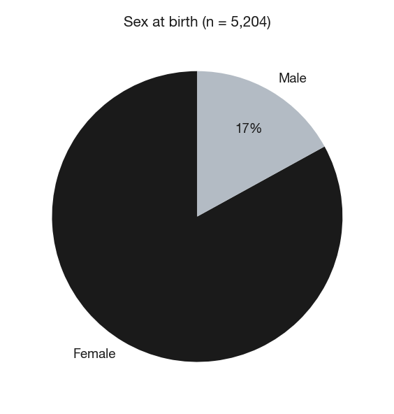
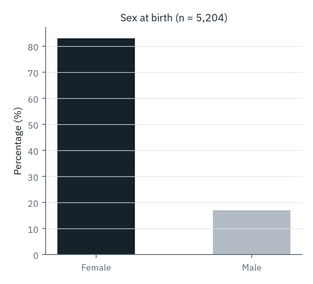
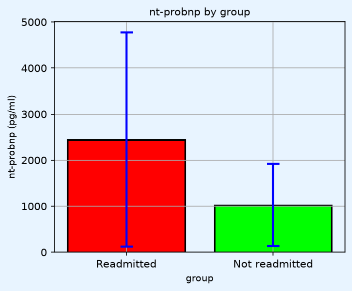
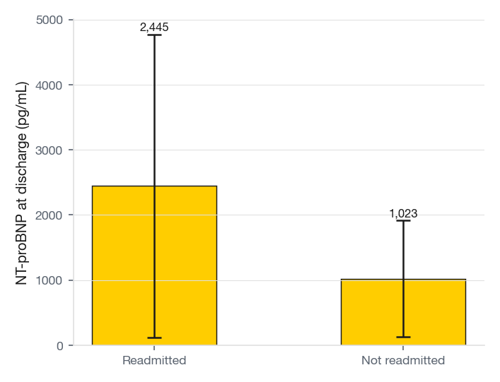
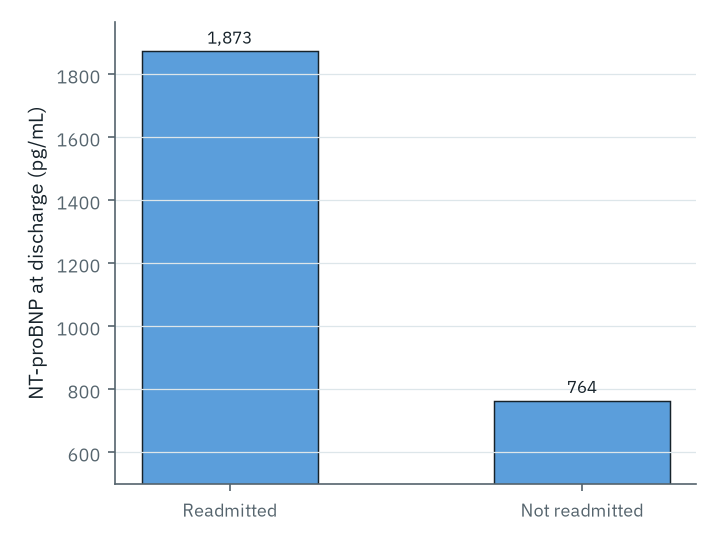
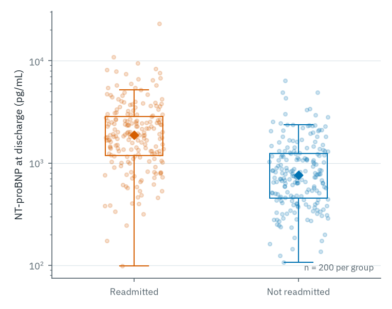

# Presenting data effectively

Readers look at tables and figures before they read the text. Each one must stand alone, legible without flipping back to the methods. Together, they should carry the paper's main message for someone who reads only the abstract, skims the headings, and studies the figures.

## Choosing the right format

- **Text** when a result is one or two numbers and no comparison is needed ("Participants were mostly female, 3,300 (83%)").
- **Table** when exact values matter, or when readers may want to compare more than two or three numbers.
- **Figure** when the pattern, distribution, or trend matters more than individual values.

Never repeat the same result across text, table, and figure; most journals will flag duplicate reporting in review.

A worked example of why the format choice matters. The same finding (*"participants were mostly female, 3,300 (83%)"*) plotted as a pie chart and a bar chart:

::: {#fig-overkill layout-ncol=2}

{#fig-pie-overkill}

{#fig-bar-overkill}

Both charts occupy valuable space to communicate a single number. The sentence *"Participants were mostly female, 3,300 (83%)"* conveys the same information in less space, with no risk of misreading.
:::

Rule of thumb: if a sentence will do the job, let it.

## Tables

Effective tables follow a few consistent rules. Avoid vertical lines. Use horizontal lines sparingly: top, bottom, and under the header is usually enough. Make the legend self-explanatory. Put units in the row or column labels, not in the cells. Keep decimal places consistent and proportionate to how precisely the variable was measured. Report group sizes in the header (`n = 242`) so every percentage is interpretable without arithmetic. Define any abbreviation in a footnote, even if it is already spelled out in the text.

A full worked example. The two tables below carry the same baseline characteristics of a (fictional) acute heart failure cohort, stratified by 30-day readmission. The first would not pass review; the second is close to what most journals expect.

**Avoid:**

| Variable    | Group 1               | Group 2                | p         |
|-------------|-----------------------|------------------------|-----------|
| Age (years) | 72.431 ± 11.89        | 70.112 ± 12.203        | 0.1823    |
| Gender      | 380 males, 260 females| 2,510 males, 2,054 females | 0.234 |
| Bmi         | 28.1 (24--31)         | 27.6                   | 0.45      |
| Smoking     | Yes 22% No 78%        | Yes 19% No 81%         | NS        |
| LVEF        | 34.56789              | 39.2                   | p = 0.000 |
| Mortality   | 82/640 (12.812%)      | 371/4564 (8.129%)      | p<.001    |

Problems: spurious precision (`72.431`, `12.812%`); inconsistent labels (`Gender`, `Bmi`); missing units on BMI and LVEF; mixed formats inside a single column; `NS` with no number; `p = 0.000` (no p-value is literally zero); `p<.001` missing both the leading zero and the space around the operator; missing thousands separator in `4564`; group sizes not in the header, forcing the reader to recompute percentages; the category label `Gender` describes a variable that is actually sex at birth, which many journals now distinguish.

**Prefer:**

| Characteristic                           | Readmitted (n = 640) | Not readmitted (n = 4,564) | p        |
|------------------------------------------|----------------------|----------------------------|----------|
| Age (years), mean ± SD                   | 72.4 ± 11.9          | 70.1 ± 12.2                | 0.18     |
| Male sex, n (%)                          | 380 (59.4)           | 2,510 (55.0)               | 0.23     |
| BMI (kg/m²), median (IQR)                | 28.1 (24.6--31.4)    | 27.6 (24.1--31.0)          | 0.45     |
| Current smoker, n (%)                    | 141 (22.0)           | 867 (19.0)                 | 0.09     |
| NYHA class III--IV, n (%)                | 402 (62.8)           | 2,191 (48.0)               | <0.001   |
| LVEF (%), mean ± SD                      | 34.6 ± 11.3          | 39.2 ± 12.6                | <0.001   |
| NT-proBNP at discharge (pg/mL), median (IQR) | 1,820 (950--3,410) | 780 (410--1,510)         | <0.001   |
| eGFR (mL/min/1.73 m²), median (IQR)      | 52 (38--68)          | 64 (49--81)                | <0.001   |
| Prior HF admission, n (%)                | 312 (48.8)           | 1,205 (26.4)               | <0.001   |
| In-hospital mortality, n (%)             | 82 (12.8)            | 371 (8.1)                  | <0.001   |

Improvements: decimals consistent and proportionate to measurement precision; units in the variable labels; `n (%)` for every categorical variable; medians with IQR for skewed variables (BMI, eGFR, NT-proBNP, the latter always reported on a skewed scale); group sizes in the header; p-values reported to two decimals, or `<0.001` when smaller; precise category labels (`Male sex`); rows ordered by a clinically intuitive logic (demographics, anthropometry, behaviour, severity, biomarkers, comorbidity, outcomes).

## Reporting numbers

Precision matters more than volume. A few rules avoid most problems in peer review.

- **Decimals.** Match the measurement precision. Age to one decimal; p-values to two or three; percentages to one decimal when n is small. More digits than the data supports looks unserious (`67.423 years` implies you know age in seconds).
- **p-values.** Two decimals when p ≥ 0.01. Three decimals when 0.001 ≤ p < 0.01. Below that, report `<0.001`. Never `p = 0.000`. Never `NS`; give the actual number so the reader can judge.
- **Estimate + 95% CI with every p-value.** A p-value says whether a difference is unlikely by chance; it does not say whether it is clinically meaningful. Report the estimate (mean difference, OR, HR, RR) with its confidence interval.
- **Statistical significance is not clinical importance.** A finding can be statistically significant and clinically trivial (e.g. *"mean LDL fell by 0.03 mmol/L (95% CI 0.01--0.05, p = 0.002)"* is significant and clinically negligible), or clinically meaningful but not statistically significant in an underpowered study. Use "significant" only when you mean statistical significance, and always pair it with the effect size so the reader can judge [@motulsky2014misconceptions].
- **Missing data.** State the denominator for every analysis. If 134 of 5,204 participants have a missing NT-proBNP value, say so (`NT-proBNP available for 5,070 of 5,204 patients, 97.4%`) and describe how you handled the missingness (complete-case, multiple imputation). STROBE item 12 covers this.
- **Units.** SI units for laboratory values (μmol/L, mmol/L) unless the target journal specifies otherwise, and consistent throughout the paper.

## Graphs

The principles of good data visualisation are rooted in Edward Tufte's core insight: maximise the ratio of data to ink, and eliminate everything that does not help the reader understand the data [@tufte2001visual]. Common errors include truncated axes that exaggerate small differences, dual y-axes that create misleading visual correlations, unnecessary 3D effects, and pie charts with too many categories. Avoid bar charts for continuous outcomes; a boxplot, violin plot, or strip plot shows the distribution, not just the mean with an error bar.

Claus Wilke's taxonomy of bad figures is useful here [@wilke2019fundamentals]. An *ugly* figure has aesthetic problems but is otherwise clear. A *bad* figure has problems related to perception: it is confusing, misleading, or overcomplicated. A *wrong* figure is mathematically incorrect. All three deserve attention during revision.

Accessibility matters. Roughly 8% of men have some form of colour vision deficiency [@birch2012diagnosis]. Use colour palettes designed for universal readability ([viridis](https://cran.r-project.org/web/packages/viridis/vignettes/intro-to-viridis.html) and [ColorBrewer](https://colorbrewer2.org/) are reliable choices), and do not rely on colour alone to distinguish categories. Duplicate colour distinctions with shape, line style, or pattern.

::: {.column-margin}
Part II goes deeper. Chapter 10 develops the principles here into a full taxonomy. Chapter 11 surveys chart types by data structure. Chapter 12 works through seven paired failure modes with corrected examples.
:::

The same fictional heart failure data, plotted four different ways, shows each failure mode and a publication-ready counterpart.

::: {#fig-wilke layout-ncol=2}

{#fig-ugly}

{#fig-bad-bar}

{#fig-bad-trunc}

{#fig-good}

NT-proBNP at discharge by 30-day readmission status (simulated). Panels A, B, and D share the same cohort (n = 200 per group); panel C uses a separate, deliberately modest scenario to isolate the truncation effect.
:::

## Figure legends

Figure legends are part of the figure, not the text. A reader who sees only the figure must understand what it shows, on whom, and how it was analysed. A complete legend includes:

- a short title (what is being shown);
- a description of groups or conditions (what each colour, line, or symbol means);
- the statistical test, and which groups are being compared;
- the sample size for each group;
- definitions of any abbreviations or symbols.

Keep interpretation out of the legend. *"Kaplan-Meier curves for 30-day readmission after acute heart failure, stratified by NT-proBNP at discharge (above vs below the cohort median). Log-rank test. n = 2,602 per group."* belongs in the legend. *"Showing that NT-proBNP identifies high-risk patients at discharge..."* belongs in the results and discussion.

::: {.column-margin}
Figures for **posters** and **oral presentations** follow different conventions: larger type, fewer panels, one take-home per slide or panel. I have written short guides on both in the *Breathe* journal's *Doing Science* series: posters [@jacinto2013poster] and oral presentations [@jacinto2014oral].
:::
