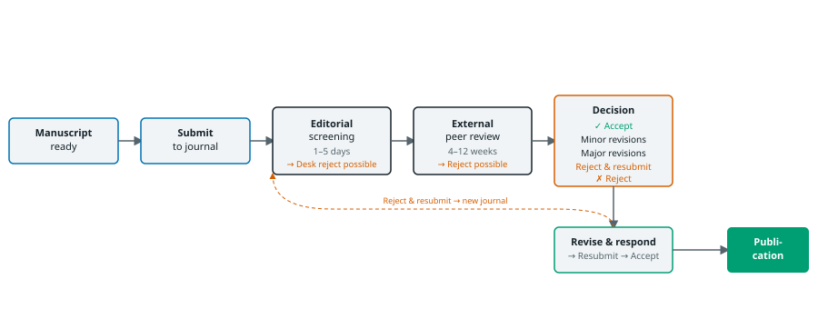

# The editorial process

::: {.callout-note appearance="simple"}
## Learning objectives
By the end of this chapter you will be able to:

- choose a journal and recognise predatory ones
- respond to reviewers point by point, including where you disagree
- prepare a submission and handle a revision or rejection
:::

{fig-align="center" fig-alt="Flow diagram from manuscript submission through editorial screening and external peer review to one of three outcomes: publication, revision, or reject-and-resubmit to another journal."}

## Choosing a journal

Before writing, decide where you want to submit. Consider the journal's scope (does it publish work like yours?), its audience (who will read it?), its impact factor and quartile ranking, average review time, and publication fees [@ecarnot2015writing]. Tools like [JANE (Journal/Author Name Estimator)](https://jane.biosemantics.org/) and the [Scimago Journal Rank](https://www.scimagojr.com/) (which provides free quartile rankings) can help narrow the choice.

Check whether the journal requires open access and what article processing charges (APCs) apply; this is particularly relevant if your institution has a read-and-publish agreement or if you are funded under Plan S, which mandates immediate open access.

::: {.column-margin}
A paper is only one part of the research cycle. **Grant applications** share many of the same writing virtues (specific question, clear methods, realistic milestones), but have their own conventions and reviewers. I have written a companion piece on funding applications for the *Breathe* *Doing Science* series [@hardavella2016funding].
:::

::: {.column-margin}
A useful journal shortlist has three to five candidates at different impact factor levels. Submitting to the highest-impact journal first is tempting, but submitting to a lower-impact journal where the editors are a better fit for your specific finding often results in faster review and higher acceptance. Speed matters for clinical findings that need to reach practice quickly.
:::

## Predatory journals

Predatory journals accept almost anything for a fee, skip genuine peer review, and can damage the record of authors who publish in them. Warning signs include unsolicited email invitations that praise a paper the sender cannot have read; guaranteed publication in days or weeks; editorial boards with no verifiable affiliations; "impact factor" claims that do not appear in Web of Science or Scopus; and aggressive follow-up emails. A paper in a predatory journal is effectively invisible to hiring and promotion committees, and several funders deduct such publications from track-record assessments.

Two safeguards before submission. Run the journal through the [Think. Check. Submit.](https://thinkchecksubmit.org/) checklist. For open access, confirm the journal is listed in the [Directory of Open Access Journals (DOAJ)](https://doaj.org/). If a senior colleague has not heard of the journal and it is not indexed in PubMed/MEDLINE, treat it as suspect.

## Preprints and open access

Posting a preprint on [medRxiv](https://www.medrxiv.org/) or [bioRxiv](https://www.biorxiv.org/) at the time of submission establishes priority, makes the work citable while the paper is under review, and invites informal community feedback. Most clinical and biomedical journals accept manuscripts that have been preprinted; a few do not. Check the journal's policy on [Jisc's Open Policy Finder](https://openpolicyfinder.jisc.ac.uk/) (the successor to SHERPA/RoMEO) before posting.

Open access comes in two main forms [@piwowar2018state]. *Gold* open access makes the article of record open at publication, usually in exchange for an APC that can be several thousand euros. *Green* open access lets you post the accepted manuscript in an institutional repository, sometimes after an embargo. Check whether your institution has a transformative or read-and-publish agreement that waives or reduces APCs with specific publishers; the [ESAC Initiative](https://esac-initiative.org/) maintains a public registry. If your funding carries [Plan S](https://www.coalition-s.org/) obligations (Wellcome, the ERC, Horizon Europe, and other [cOAlition S signatories](https://www.coalition-s.org/plan-s-funders-implementation/)), immediate open access without embargo is usually mandatory. The [NIH Public Access Policy](https://publicaccess.nih.gov/), revised in 2024 and in effect since 2025, imposes similar requirements on US-funded research.

## Before submission

A manuscript is rarely as good as its authors think. Two steps before submission reduce surprise rejections:

1. **Check against the reporting guideline.** Map every item of CONSORT, STROBE, PRISMA, or whichever applies to your manuscript. Editors do this on receipt, and missing items are the fastest path to desk rejection.
2. **Ask two people who are not co-authors to read it.** One from inside the target journal's readership (does the argument land?) and one from outside the field (is the language clear to a non-specialist?). Give each a specific question, for example *"after reading the abstract, what do you expect the main finding to be?"*, rather than asking for "any thoughts."

Confirm the obvious before hitting submit: author order and affiliations are current; all ICMJE authorship criteria are met; funding, ethics approval, and data-availability statements are present; every table and figure is referenced in the text; the reference list has no broken DOIs.

::: {.column-margin}
Realistic timelines for a healthcare paper. First draft to submission-ready: 3--6 months. Submission to first decision: 1--3 months (often longer at high-impact journals). Revision and resubmission: 2--6 months. Acceptance to print: 1--6 months. A "quick" paper in clinical research is typically 12--18 months from idea to PubMed-indexed publication. Plan accordingly.
:::

## Cover letters

Keep cover letters short. State the manuscript title, the main finding, and why it is relevant to this journal's readership. Include the standard declarations (original work, no simultaneous submission, all authors have approved, conflicts of interest disclosed). Two to three paragraphs are sufficient.

A standard structure that works well:

```text
Dear Dr [Editor name],

We would like to submit our manuscript, "NT-proBNP at discharge
predicts 30-day readmission in acute heart failure: a retrospective
cohort study," for consideration for publication in [Journal Name].
We report that NT-proBNP at discharge was independently associated
with 30-day unplanned readmission (adjusted HR 1.24, 95% CI 1.13–1.36)
in a cohort of 5,204 adults hospitalised for acute heart failure,
after adjustment for age, sex, LVEF, and NYHA class.
This finding has direct implications for discharge risk stratification
and post-discharge follow-up planning.

The manuscript is original, has not been published elsewhere, and is
not under consideration at any other journal. All authors have approved
the submitted version. We confirm no conflicts of interest. The study
was approved by [Ethics Committee Name] (approval number: XXX/YYYY).

Please address all correspondence to the corresponding author.
The manuscript is 3,842 words, with 4 figures and 3 tables.

Sincerely,
Tiago Jacinto
```

::: {.column-margin}
If the journal's editorial system asks you to suggest reviewers, include three to five relevant experts with their institutional affiliations. Editors appreciate this; it speeds up the editor-in-chief's search and often results in better-matched reviewers than random assignment. Never suggest someone with a conflict of interest.
:::

## Peer review

Systematic external peer review took shape in journals such as *Science* and the *New England Journal of Medicine* in the 1940s and became routine across medicine in the early 1970s [@spier2002history]. It attempts to ensure that published work meets minimum standards of quality, but it is not infallible. Hans Krebs's 1937 paper on the citric-acid cycle was famously rejected by *Nature* before being published elsewhere; many other now-landmark papers have been rejected or heavily revised before publication. This is not failure of the system but evidence that it works imperfectly.

::: {.column-margin}
Peer review is a floor, not a ceiling: it filters out obvious errors, not subtle ones. Your responsibility for your own work does not end when reviewers sign off.
:::

## Responding to reviewers

When reviewer comments arrive, pause before responding. Read the comments, wait until any emotional reaction subsides, and then draft a structured, point-by-point response. For each comment: thank the reviewer, state what you changed (with the revised text quoted), and, if you disagree, say so politely and back it with evidence. Reviewers and editors are unpaid volunteers; a clear, well-organised response makes their job easier and improves your chances of a favourable decision.

A worked example. A reviewer's comment and a response that does its job:

> **Reviewer 2, comment 3.** *"The authors do not adjust for estimated glomerular filtration rate (eGFR), which is a well-established confounder of the relationship between NT-proBNP and cardiovascular outcomes. This is a significant omission."*

> **Response.** *"We thank the reviewer for this point. eGFR at discharge was recorded for all 5,204 patients. We have added it as a covariate in the multivariable Cox model (revised Table 3). The association between NT-proBNP at discharge and readmission was slightly attenuated and remained significant (adjusted HR 1.23, 95% CI 1.13--1.35, p < 0.001, from 1.24, 95% CI 1.13--1.36). The Methods (page 7, paragraph 2) and Discussion (page 14, paragraph 3) have been updated to describe this analysis and to note that the two variables may share predictive information."*

Three things make this response work. It thanks the reviewer without grovelling. It states exactly what changed, with numbers and page references. It is honest about the analytical consequence (the coefficient attenuated) rather than hiding it.

::: {.column-margin}
When you disagree, a respectful template works: *"We appreciate the reviewer's suggestion. We considered this option but, on balance, prefer to retain the original analysis because [specific reason]. We have added a sentence to the Limitations section acknowledging this alternative interpretation."* Never argue; explain.
:::

## Revisions and rejections

Most manuscripts receive *major revisions* on first review. Treat the revision as an extension of the writing process, not a formality. Typical deadlines are four to six weeks. Address every comment in the point-by-point response, even comments you disagree with; silence reads as dismissal.

*Minor revisions* usually mean the editor has decided to accept but wants specific fixes. Turn these around within one to two weeks. This is not the moment to reopen scientific debates.

*Rejection after review* is the common outcome at high-impact journals. Read the reviews carefully; they are free pre-submission feedback for the next journal. Incorporate the reasonable suggestions, choose a new target that fits the finding, and submit within two to four weeks while the work is still fresh in your head.

*Rejection without review* (desk rejection) is not a judgement on the science. It usually means the paper fell outside scope, did not match the audience, or fell below the journal's significance threshold. Do not appeal unless you have a specific, factual error to point out. Move on quickly.

## Reviewing other people's work

Most early-career researchers are invited to review before they feel ready. Accept invitations that match your expertise and decline (politely, quickly) those that do not. Reviewing well is a skill that grows with practice, and nothing else teaches you faster how editors actually read manuscripts.

A useful review has three parts:

1. **A short summary of the paper.** Two or three sentences in your own words. This confirms to the editor that you read the manuscript and gives the authors a chance to see how a careful reader understood their argument.
2. **Major comments.** The issues that, in your view, would need to change before publication: methodological problems, missing analyses, overreach, unsupported claims. Numbered, specific, and actionable.
3. **Minor comments.** Typographical, stylistic, and sentence-level suggestions. Numbered.

Two conventions matter. Write to the authors, not about them: *"the authors should consider..."* rather than *"the authors failed to..."*. And separate *confidential comments to the editor* (where you make a recommendation and may be candid about fit or significance) from comments sent to the authors.

Expect to spend four to eight hours on a first full review. Claim credit via [ORCID](https://orcid.org/) or the publisher's integration with Web of Science Reviewer Recognition. Reviewing is unpaid work, but it builds editorial judgement that steadily improves your own writing.

## Practice: responding to peer review

*These exercises are for self-check or peer workshop use. Try each before expanding the answer.*

A reviewer has sent the following comment on your manuscript.

> *"The limitations section is too brief. The authors do not discuss the potential for selection bias given that recruitment was limited to two tertiary hospitals, nor do they address loss-to-follow-up in adequate depth. The generalisability of the findings to primary care settings is not discussed at all."*

Draft a response that follows the point-by-point format described in this chapter. Your response should:

- Acknowledge the concern directly and specifically, without being defensive;
- Describe what change you made to the manuscript;
- Quote the revised text (you can write a plausible revision).

There is no single correct answer — what matters is the structure: acknowledge, change, quote.

::: {.callout-tip collapse="true"}
## Answer

Model response:

> *"We thank the reviewer for this comment. We have expanded the Limitations section to address both points.*
>
> *On selection bias: both hospitals are tertiary referral centres, which means our cohort is enriched for patients with more severe acute heart failure than would be seen in district hospitals or primary care. We have added the following sentence: 'Both participating centres are tertiary referral hospitals; the cohort may not represent the full severity spectrum of acute heart failure managed in primary and secondary care settings.'*
>
> *On loss-to-follow-up: readmission was ascertained from the national hospital registry, which records all acute hospital encounters, but does not capture primary care or outpatient contacts. Of 5,204 patients, national registry linkage was successful for 5,198 (99.9%). We have added: 'Loss-to-follow-up was minimal given registry linkage (99.9% successful); however, readmissions managed in outpatient or primary care settings would not be captured.'*
>
> *The revised Limitations section is on pages 15–16 of the manuscript."*
:::
