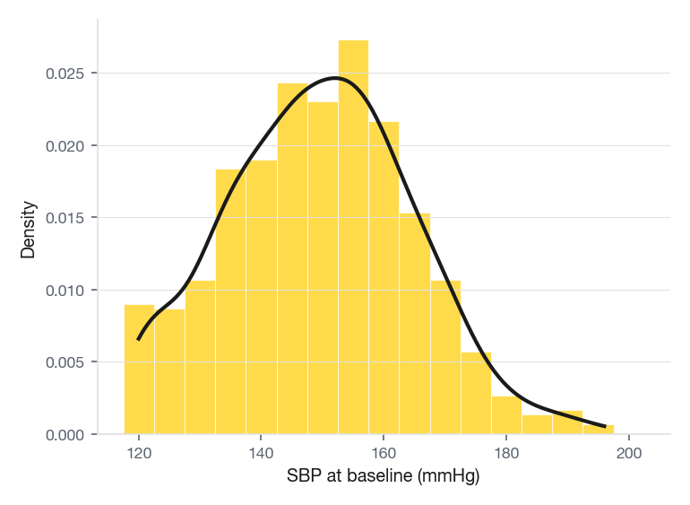
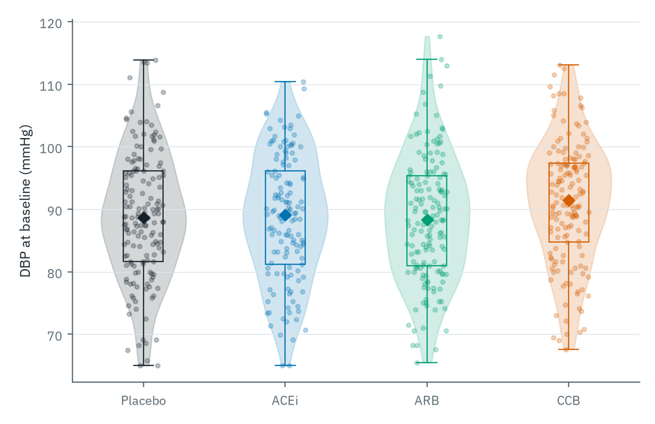
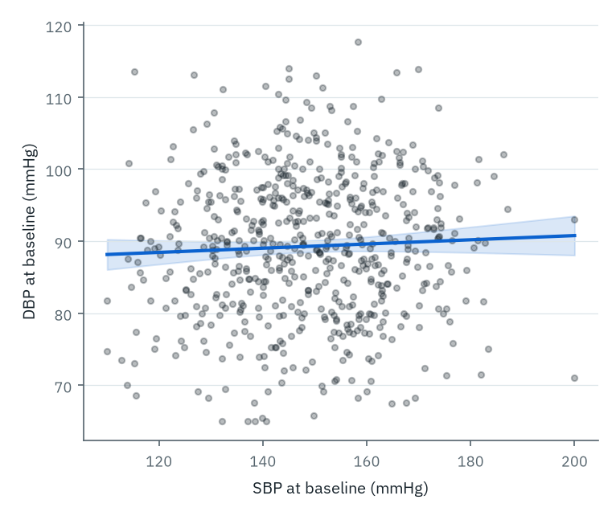
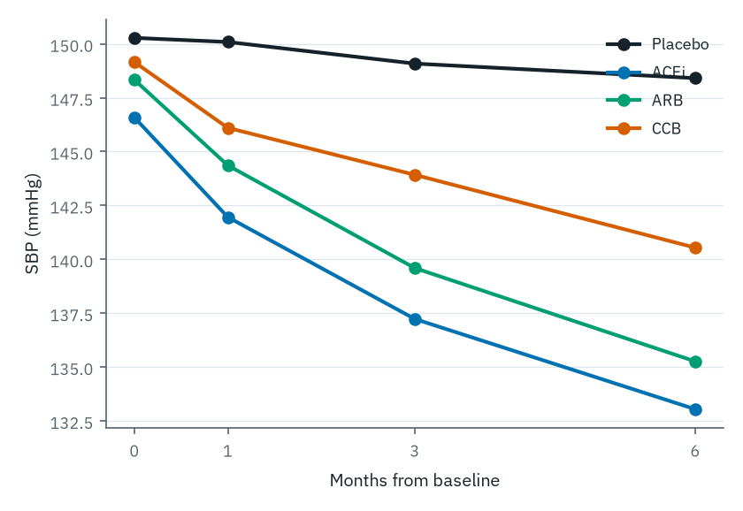
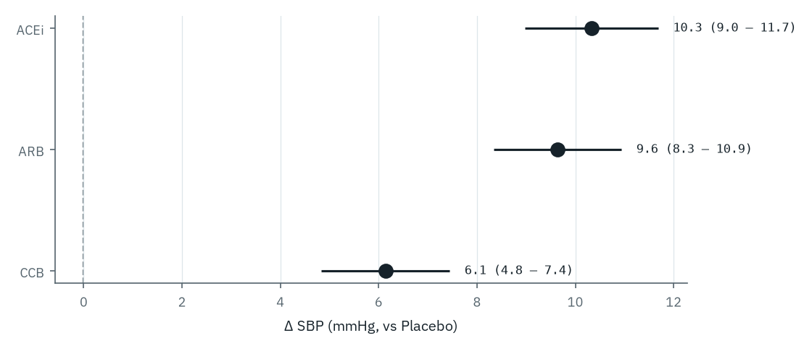
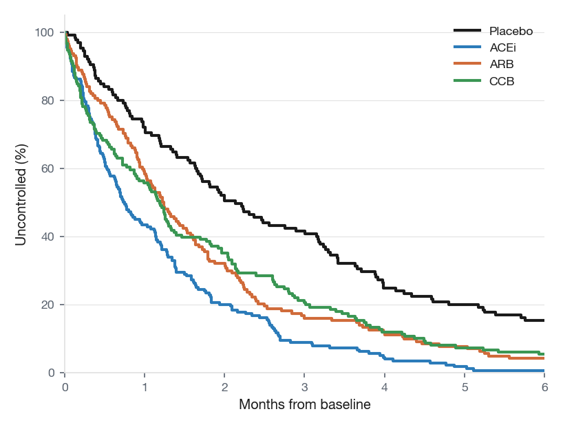

# Common chart types

Before diagnosing failures, the toolkit needs to be established. Six chart types cover most figures in clinical and epidemiological research; each is the right choice when the data structure and the message align.

## Histogram and density: one variable's distribution

A histogram bins a single continuous variable into ranges and draws the count (or density) of observations per bin. The bin width is the only knob, and it changes the chart's character: too narrow, and the histogram becomes noisy; too wide, and meaningful structure (bimodality, a clipped lower limit) gets erased. Pair the histogram with a kernel density estimate, as in @fig-type-histogram, to keep both the discrete and the smoothed silhouette visible. Use it for any continuous variable in your cohort: age, BMI, lab values, biomarkers. Watch for clipped distributions (an assay's lower limit of detection appearing as a spike) and right-skew (HbA1c, NT-proBNP, CRP), where a log-x axis is often more honest.

{#fig-type-histogram}

::: {.callout-note collapse="true"}
## Code

::: {.panel-tabset}

#### R

```r
library(ggplot2); library(pequod)

ggplot(cohort, aes(sbp_baseline)) +
  geom_histogram(aes(y = after_stat(density)),
                 binwidth = 5,
                 fill = pequod_crew_light[["Starbuck"]],
                 colour = "white", linewidth = 0.4) +
  geom_density(colour = pequod_crew_dark[["Ahab"]], linewidth = 1.0) +
  labs(x = "SBP at baseline (mmHg)", y = "Density") +
  theme_minimal(base_family = "Atkinson Hyperlegible Next")
```

#### Python

```python
import seaborn as sns
import matplotlib.pyplot as plt
import pequod

fig, ax = plt.subplots(figsize=(6.4, 3.6))
sns.histplot(data=cohort, x="sbp_baseline", binwidth=5,
             stat="density", color=pequod.CREW_LIGHT["Starbuck"],
             edgecolor="white", ax=ax)
sns.kdeplot(data=cohort, x="sbp_baseline",
            color=pequod.CREW_DARK["Ahab"], linewidth=2, ax=ax)
ax.set(xlabel="SBP at baseline (mmHg)", ylabel="Density")
sns.despine(); fig.tight_layout()
```

:::

:::

## Boxplot, strip plot, and violin: distribution by group

A boxplot summarises a distribution as five numbers: median, quartiles, whiskers. A strip plot shows every observation as a jittered dot. A violin plot shows the kernel density mirrored around a vertical axis. Layered together, as in @fig-type-distribution, they cover the full vocabulary: median for the centre, IQR for the spread, individual points for outliers and sample size, and the violin's silhouette for shape. For small groups (n < 30), drop the box and just show the points; the percentile machinery is unstable. Use this combination for comparing the distribution of a continuous variable across two or more groups. The temptation to replace the whole layered chart with a bar of means and an error whisker is the failure mode addressed in the pitfalls chapter.

{#fig-type-distribution}

::: {.callout-note collapse="true"}
## Code

::: {.panel-tabset}

#### R

```r
library(ggplot2); library(pequod)

ggplot(cohort, aes(treatment, dbp_baseline,
                   colour = treatment, fill = treatment)) +
  geom_violin(alpha = 0.18, linewidth = 0.4) +
  geom_jitter(width = 0.16, alpha = 0.30, size = 1.3) +
  geom_boxplot(width = 0.18, fill = NA, outlier.shape = NA, linewidth = 0.5) +
  scale_colour_pequod_d(palette = "crew") +
  scale_fill_pequod_d(palette = "crew") +
  labs(x = NULL, y = "DBP at baseline (mmHg)") +
  theme_minimal(base_family = "Atkinson Hyperlegible Next") +
  theme(legend.position = "none")
```

#### Python

```python
import seaborn as sns
import matplotlib.pyplot as plt
import pequod

crew = list(pequod.CREW_DARK.values())[:4]

fig, ax = plt.subplots(figsize=(6.4, 4))
sns.violinplot(data=cohort, x="treatment", y="dbp_baseline",
               palette=crew, fill=False, linewidth=0.6, ax=ax)
sns.stripplot(data=cohort, x="treatment", y="dbp_baseline",
              palette=crew, alpha=0.30, jitter=0.16, size=3, ax=ax)
sns.boxplot(data=cohort, x="treatment", y="dbp_baseline",
            palette=crew, showfliers=False, fill=False,
            width=0.18, ax=ax)
ax.set(xlabel=None, ylabel="DBP at baseline (mmHg)")
sns.despine(); fig.tight_layout()
```

:::

:::

## Scatter plot: two continuous variables

A scatter plot puts two continuous variables on the two axes and one dot per observation. Each point is one observation; the scatter plot is the most direct depiction of a bivariate relationship in statistics. A regression line with a confidence ribbon, as in @fig-type-scatter, summarises the trend without erasing the underlying spread; a third variable can be encoded with colour or shape. Use scatter for any pair of continuous variables: SBP versus DBP, age versus a lab value, dose versus response. The failure mode at large n is overplotting; alpha transparency, hex-binning (`geom_hex`), or 2D density contours all help.

{#fig-type-scatter}

::: {.callout-note collapse="true"}
## Code

::: {.panel-tabset}

#### R

```r
library(ggplot2); library(pequod)

ggplot(cohort, aes(sbp_baseline, dbp_baseline)) +
  geom_point(alpha = 0.30, colour = pequod_crew_dark[["Queequeg"]],
             size = 1.4) +
  geom_smooth(method = "lm", se = TRUE,
              colour = pequod_crew_dark[["Ahab"]],
              fill   = pequod_crew_light[["Ahab"]], alpha = 0.25) +
  labs(x = "SBP at baseline (mmHg)", y = "DBP at baseline (mmHg)") +
  theme_minimal(base_family = "Atkinson Hyperlegible Next")
```

#### Python

```python
import seaborn as sns
import matplotlib.pyplot as plt
import pequod

fig, ax = plt.subplots(figsize=(6.4, 4.4))
sns.regplot(data=cohort, x="sbp_baseline", y="dbp_baseline",
            scatter_kws=dict(alpha=0.30, color=pequod.CREW_DARK["Queequeg"], s=14),
            line_kws=dict(color=pequod.CREW_DARK["Ahab"], linewidth=2),
            ax=ax)
ax.set(xlabel="SBP at baseline (mmHg)", ylabel="DBP at baseline (mmHg)")
sns.despine(); fig.tight_layout()
```

:::

:::

## Line plot: change over an ordered axis

A line plot connects points across an ordered x-axis (usually time, visit, or dose) so that the trajectory itself is the visual unit. Where a scatter or bar tells you "where", a line tells you "where, then where, then where", and the eye reads the slope pre-attentively. @fig-type-line shows the mean SBP per arm across the four study visits. Use line plots for longitudinal cohort means, time series of an outcome by group, and dose-response curves. The two failure modes at the extremes are too many lines on one panel (the spaghetti pitfall) and the two-axis trap (both addressed in the next chapter).

{#fig-type-line}

::: {.callout-note collapse="true"}
## Code

::: {.panel-tabset}

#### R

```r
library(ggplot2); library(pequod); library(dplyr)

# `traj_summary` has columns: treatment, month, sbp (mean per group/visit)
ggplot(traj_summary, aes(month, sbp, colour = treatment)) +
  geom_line(linewidth = 1.3) +
  geom_point(size = 2.4) +
  scale_colour_pequod_d(palette = "crew") +
  scale_x_continuous(breaks = c(0, 1, 3, 6)) +
  labs(x = "Months from baseline", y = "SBP (mmHg)", colour = NULL) +
  theme_minimal(base_family = "Atkinson Hyperlegible Next")
```

#### Python

```python
import seaborn as sns
import matplotlib.pyplot as plt
import pequod

crew = list(pequod.CREW_DARK.values())[:4]

fig, ax = plt.subplots(figsize=(7.2, 4))
sns.lineplot(data=traj_summary, x="month", y="sbp",
             hue="treatment", palette=crew,
             marker="o", linewidth=2, ax=ax)
ax.set(xlabel="Months from baseline", ylabel="SBP (mmHg)")
ax.set_xticks([0, 1, 3, 6])
sns.despine(); fig.tight_layout()
```

:::

:::

## Forest plot: effect sizes with confidence

A forest plot puts one effect-size estimate per row, each with its 95 % confidence interval drawn as a horizontal whisker. The reader sees the point estimate and its precision in a single glance, and a vertical reference line at zero (or 1 for ratios) does the rhetorical work of "is this difference compatible with no effect?". @fig-type-forest shows the effect of each active arm versus placebo on six-month SBP change. Forest plots are central to clinical research: subgroup analyses, regression coefficients, and meta-analyses all live in this format. Watch for stretched x-axes that make small effects look substantial, and report the test statistic alongside the interval.

{#fig-type-forest}

::: {.callout-note collapse="true"}
## Code

::: {.panel-tabset}

#### R

```r
library(ggplot2); library(pequod)

fit_lm <- lm(delta_sbp ~ treatment, data = cohort)
ci <- confint(fit_lm)
co <- coef(fit_lm)
forest_data <- data.frame(
  arm      = sub("^treatment", "", names(co)[-1]),
  estimate = unname(co[-1]),
  lo       = ci[-1, 1],
  hi       = ci[-1, 2]
) |>
  transform(arm = factor(arm, levels = rev(c("ACEi", "ARB", "CCB"))))

ggplot(forest_data, aes(estimate, arm)) +
  geom_vline(xintercept = 0, linetype = "dashed") +
  geom_errorbar(aes(xmin = lo, xmax = hi), width = 0.18,
                colour = pequod_crew_dark[["Ahab"]],
                orientation = "y") +
  geom_point(colour = pequod_crew_dark[["Ahab"]], size = 4) +
  geom_text(aes(x = hi, label = sprintf("%.1f  (%.1f – %.1f)",
                                        estimate, lo, hi)),
            hjust = 0, nudge_x = 0.4, family = "JetBrains Mono", size = 3.3) +
  labs(x = "Δ SBP (mmHg, vs Placebo)", y = NULL) +
  theme_minimal(base_family = "Atkinson Hyperlegible Next")
```

#### Python

```python
import statsmodels.formula.api as smf
import seaborn as sns
import matplotlib.pyplot as plt
import pequod

fit = smf.ols("delta_sbp ~ C(treatment, Treatment(reference='Placebo'))",
              data=cohort).fit()
ci = fit.conf_int().rename(columns={0: "lo", 1: "hi"})
forest = (fit.params.to_frame("estimate")
              .join(ci).reset_index().rename(columns={"index": "term"}))
forest = forest[forest["term"].str.contains("T.")]
forest["arm"] = forest["term"].str.extract(r"T\.([A-Za-z]+)")
forest = forest.set_index("arm").loc[["ACEi", "ARB", "CCB"]].reset_index()

fig, ax = plt.subplots(figsize=(7.2, 3.2))
ax.axvline(0, color="grey", linestyle="--")
ax.errorbar(x=forest["estimate"], y=forest["arm"],
            xerr=[forest["estimate"] - forest["lo"],
                  forest["hi"]      - forest["estimate"]],
            fmt="o", color=pequod.CREW_DARK["Ahab"],
            ms=10, capsize=4)
for _, r in forest.iterrows():
    ax.text(r["hi"] + 0.4, r["arm"],
            f'{r["estimate"]:.1f}  ({r["lo"]:.1f} – {r["hi"]:.1f})',
            va="center", family="JetBrains Mono")
ax.set(xlabel="Δ SBP (mmHg, vs Placebo)", ylabel=None)
sns.despine(); fig.tight_layout()
```

:::

:::

## Kaplan–Meier curve: time to event

A Kaplan–Meier curve plots the proportion of the cohort still event-free over time, dropping in steps as events occur. Censoring (loss to follow-up) is shown by tick marks. Two or more groups can be overlaid for direct comparison of survival or event-free trajectories. @fig-type-km shows time to BP control across the four arms, computed via `survival::survfit()` with synthetic event times. Use it for time-to-event outcomes: death, hospitalisation, recurrence, or any "first time the outcome happened" measure. The classic missing element in published KM plots is the *number-at-risk* table below the x-axis; without it, the visual confidence in the right-hand tail can far exceed the actual sample size.

{#fig-type-km}

::: {.callout-note collapse="true"}
## Code

::: {.panel-tabset}

#### R

```r
library(ggplot2); library(pequod); library(survival); library(dplyr)

# cohort_km has: treatment, event_time (months), event (0/1)
fit  <- survfit(Surv(event_time, event) ~ treatment, data = cohort_km)
sfit <- summary(fit, times = seq(0, 6, by = 0.25), extend = TRUE)

km_df <- data.frame(
  time      = sfit$time,
  surv      = sfit$surv,
  treatment = factor(gsub("treatment=", "", as.character(sfit$strata)),
                     levels = c("Placebo", "ACEi", "ARB", "CCB"))
)

ggplot(km_df, aes(time, surv, colour = treatment)) +
  geom_step(linewidth = 1.1) +
  scale_colour_pequod_d(palette = "crew") +
  scale_y_continuous(labels = scales::percent_format(), limits = c(0, 1)) +
  scale_x_continuous(breaks = 0:6) +
  labs(x = "Months from baseline", y = "Uncontrolled (%)", colour = NULL) +
  theme_minimal(base_family = "Atkinson Hyperlegible Next")
```

#### Python

```python
import seaborn as sns
import matplotlib.pyplot as plt
import pequod
from lifelines import KaplanMeierFitter

crew = list(pequod.CREW_DARK.values())[:4]

fig, ax = plt.subplots(figsize=(7.2, 4))
for arm, colour in zip(["Placebo", "ACEi", "ARB", "CCB"], crew):
    sub = cohort_km[cohort_km["treatment"] == arm]
    KaplanMeierFitter().fit(sub["event_time"], sub["event"], label=arm) \
        .plot_survival_function(ax=ax, color=colour, ci_show=False)
ax.set(xlabel="Months from baseline", ylabel="Uncontrolled (%)")
ax.set_yticks([0, 0.25, 0.5, 0.75, 1.0])
ax.set_yticklabels(["0%", "25%", "50%", "75%", "100%"])
sns.despine(); fig.tight_layout()
```

:::

:::
