# Seven paired pitfalls

::: {.callout-note appearance="simple"}
## Learning objectives
By the end of this chapter you will be able to:

- recognise seven common figure failures and their fixes
- avoid truncated axes, rainbow palettes, and mean-hiding bars
- turn a misleading figure into an honest one
:::

::: {.column-margin}
Each pitfall here maps to a rule in Part I. The three rules in the results section of [article structure](02-article-structure.qmd) and the graph guidance in [presenting data](04-presenting-data.qmd) are the writing counterparts to the visual failures corrected below.
:::

Every chart type in the previous chapter has a characteristic way of going wrong. Each pair below shows the same data drawn two ways: a *bad / ugly / wrong* version, then a *good* version.

## 1. Pie chart → ordered horizontal bar

The pie chart is the bad chart most often defended in health research. The eye is poor at angle judgement, and slices that differ by only a few percentage points are nearly indistinguishable. A horizontal bar chart ordered by frequency replaces angle judgement with position on a common scale, the strongest visual encoding available [@cleveland1984graphical]. Compare @fig-pie with @fig-bar.

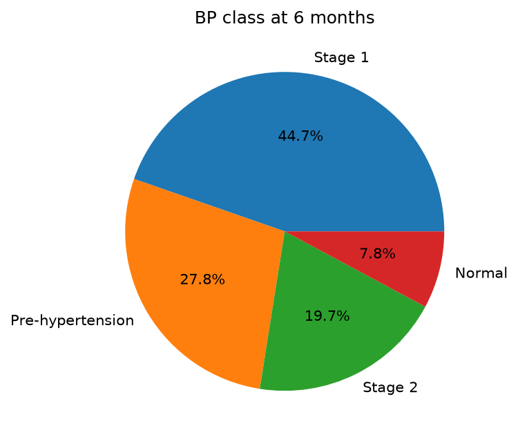{#fig-pie fig-alt="A pie chart of blood-pressure class at six months whose Pre-hypertension and Stage 2 slices are too close in size to rank by eye."}

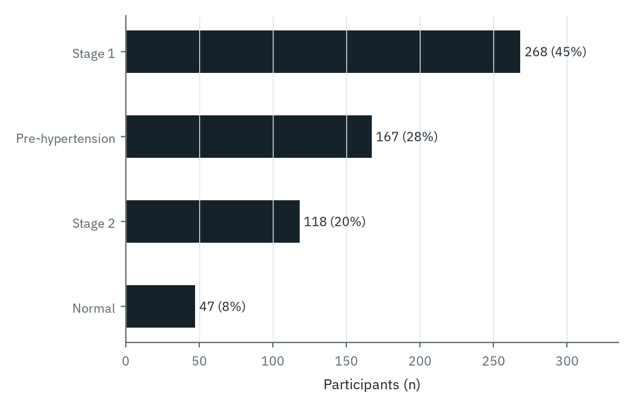{#fig-bar fig-alt="The same blood-pressure-class data as a horizontal bar chart sorted by count, each bar labelled with its count and percentage."}

::: {.callout-note collapse="true"}
## Code

::: {.panel-tabset}

#### R

```r
library(ggplot2); library(dplyr)
source("glauca.R")

bp_counts <- cohort |>
  count(bp_class_6m) |>
  mutate(pct = n / sum(n))

ggplot(bp_counts, aes(reorder(bp_class_6m, n), n)) +
  geom_col(fill = "#16222a", width = 0.7) +
  geom_text(aes(label = sprintf("%d  (%.0f%%)", n, 100 * pct)),
            hjust = -0.15, family = "IBM Plex Mono", size = 3.4) +
  coord_flip(clip = "off") +
  scale_y_continuous(expand = expansion(mult = c(0, 0.32))) +
  labs(x = NULL, y = "Participants (n)") +
  theme_glauca()
```

#### Python

```python
import pandas as pd
import seaborn as sns
import matplotlib.pyplot as plt

cohort = pd.read_csv("figures/dataviz/cohort.csv")
counts = (cohort["bp_class_6m"].value_counts()
          .rename_axis("class").reset_index(name="n"))
counts = counts.sort_values("n").reset_index(drop=True)
counts["pct"] = counts["n"] / counts["n"].sum()

fig, ax = plt.subplots(figsize=(6.4, 4))
sns.barplot(data=counts, y="class", x="n",
            color="#0b62cf", ax=ax)
for i, row in counts.iterrows():
    ax.text(row["n"] + 6, i, f'{row["n"]}  ({row["pct"]:.0%})',
            va="center", family="monospace")
ax.set(xlabel="Participants (n)", ylabel=None)
sns.despine(); fig.tight_layout()
```

:::

:::

## 2. Rainbow heatmap → sequential ramp

The default `rainbow()` palette stays popular in scientific computing despite being non-monotonic in luminance: yellow is brighter than red and green, and the eye reads brightness as magnitude. A sequential ramp (light to dark) maps luminance and value onto the same axis, so bigger means darker without ambiguity. The Glauca `glauca_seq` ramp is one such palette; viridis is another. Compare the same heatmap rendered both ways, @fig-rainbow against @fig-sequential.

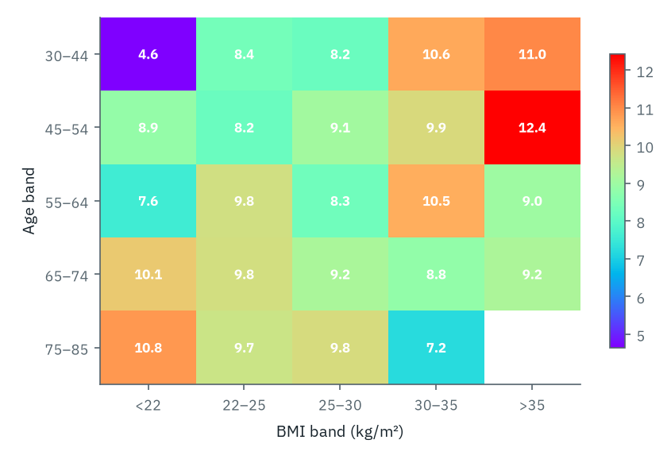{#fig-rainbow fig-alt="A heatmap of mean systolic reduction by age and BMI band using a rainbow palette, where hue does not track magnitude."}

{#fig-sequential fig-alt="The same heatmap on a single-hue sequential ramp where darker cells clearly mean larger reductions."}

::: {.callout-note collapse="true"}
## Code

::: {.panel-tabset}

#### R

```r
library(ggplot2); library(dplyr)
source("glauca.R")

heat <- cohort |>
  mutate(
    age_band = cut(age, c(29, 45, 55, 65, 75, 86), include.lowest = TRUE,
                   labels = c("30-44","45-54","55-64","65-74","75-85")),
    bmi_band = cut(bmi, c(0, 22, 25, 30, 35, 100), include.lowest = TRUE,
                   labels = c("<22","22-25","25-30","30-35",">35"))
  ) |>
  group_by(age_band, bmi_band) |>
  summarise(delta = mean(sbp_baseline - sbp_6m), .groups = "drop")

ggplot(heat, aes(bmi_band, age_band, fill = delta)) +
  geom_tile(colour = "white", linewidth = 0.4) +
  scale_fill_glauca_c(name = "Δ SBP\n(mmHg)") +
  geom_text(aes(label = sprintf("%.1f", delta)),
            family = "IBM Plex Mono", size = 3.1, colour = "white") +
  labs(x = "BMI band (kg/m²)", y = "Age band (years)") +
  theme_glauca()
```

#### Python

```python
import seaborn as sns
import matplotlib.pyplot as plt
import glauca
import numpy as np

glauca.use_glauca("light")

heat = (cohort.assign(
    age_band = pd.cut(cohort["age"], [29,45,55,65,75,86],
                      labels=["30-44","45-54","55-64","65-74","75-85"]),
    bmi_band = pd.cut(cohort["bmi"], [0,22,25,30,35,100],
                      labels=["<22","22-25","25-30","30-35",">35"]),
    delta    = cohort["sbp_baseline"] - cohort["sbp_6m"])
    .groupby(["age_band","bmi_band"])["delta"].mean().unstack())

fig, ax = plt.subplots(figsize=(6.4, 4))
sns.heatmap(heat, cmap="glauca_seq", annot=True, fmt=".1f",
            annot_kws={"family": "monospace"},
            cbar_kws={"label": "Δ SBP (mmHg)"}, ax=ax)
ax.set(xlabel="BMI band (kg/m²)", ylabel="Age band (years)")
fig.tight_layout()
```

:::

:::

## 3. Truncated y-axis → honest baseline

This is the single most common dishonest figure in clinical journals. Pick a y-axis that starts somewhere convenient (132 mmHg in the example below) and a 10-mmHg gap looks like a chasm. The numbers are right; the visual claim is wrong. Tufte calls this a *lie factor* [@tufte2001visual], Wilke calls it *proportional ink* [@wilke2019fundamentals]. The fix is to anchor at zero whenever the y-axis encodes magnitude with bar length. If the differences then look small, the differences *are* small, and the chart should say so. @fig-truncated and @fig-honest plot the same four numbers.

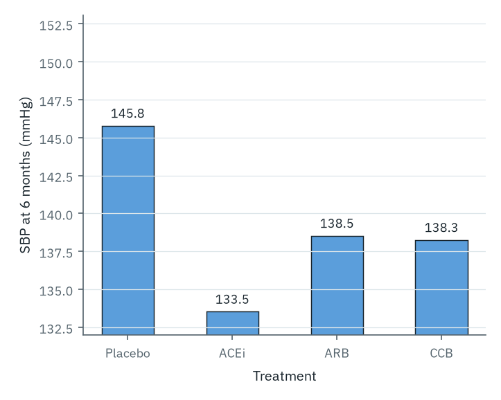{#fig-truncated fig-alt="A bar chart of mean six-month systolic by treatment with the y-axis starting at 132 mmHg, exaggerating a roughly 11 mmHg difference into an almost fourfold apparent gap."}

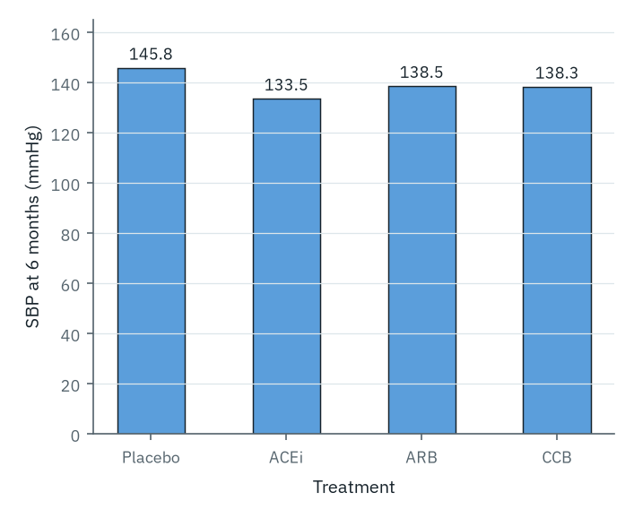{#fig-honest fig-alt="The same means on a zero-anchored y-axis, where the between-arm differences look proportionally small."}

::: {.callout-warning}
## When truncation is honest

The zero rule applies to *bar lengths* because the bar's length encodes the value. It does not apply to *line charts* or *dot plots* showing position over time, where the eye reads the slope of change rather than the height of an ink rectangle. A heart-rate strip from 60 to 100 bpm need not show the gap from 0 to 60: there is no rectangle to inflate.
:::

::: {.callout-note collapse="true"}
## Code

::: {.panel-tabset}

#### R

```r
library(ggplot2); library(dplyr)
source("glauca.R")

trt_summary <- cohort |>
  group_by(treatment) |>
  summarise(sbp_6m_mean = mean(sbp_6m),
            se = sd(sbp_6m) / sqrt(n()), .groups = "drop")

ggplot(trt_summary, aes(treatment, sbp_6m_mean)) +
  geom_col(fill = "#16222a", width = 0.65) +
  geom_errorbar(aes(ymin = sbp_6m_mean - se, ymax = sbp_6m_mean + se),
                width = 0.15) +
  geom_text(aes(label = sprintf("%.1f", sbp_6m_mean)),
            vjust = -1.6, family = "IBM Plex Mono", size = 3.4) +
  scale_y_continuous(limits = c(0, 160),
                     expand = expansion(mult = c(0, 0.05))) +
  labs(x = NULL, y = "SBP (mmHg)") +
  theme_glauca()
```

#### Python

```python
import seaborn as sns
import matplotlib.pyplot as plt

summ = (cohort.groupby("treatment")["sbp_6m"]
              .agg(mean="mean", se=lambda x: x.std()/len(x)**0.5)
              .reset_index())

fig, ax = plt.subplots(figsize=(6.4, 4))
sns.barplot(data=summ, x="treatment", y="mean",
            color="#5b9edb", errorbar=None, ax=ax)
ax.errorbar(x=summ["treatment"], y=summ["mean"], yerr=summ["se"],
            fmt="none", color="black", capsize=4)
for i, m in enumerate(summ["mean"]):
    ax.text(i, m + 4, f"{m:.1f}", ha="center", family="monospace")
ax.set(xlabel=None, ylabel="SBP (mmHg)", ylim=(0, 160))
sns.despine(); fig.tight_layout()
```

:::

:::

## 4. Donut row → ranked dot plot

A row of pies or donuts asks the reader to compare angles across panels. Each donut is its own coordinate system, and the eye cannot triangulate between them. A dot plot puts every group on a single common scale, sortable by effect, and the comparison becomes automatic. The same data appears in @fig-donut and @fig-dotplot.

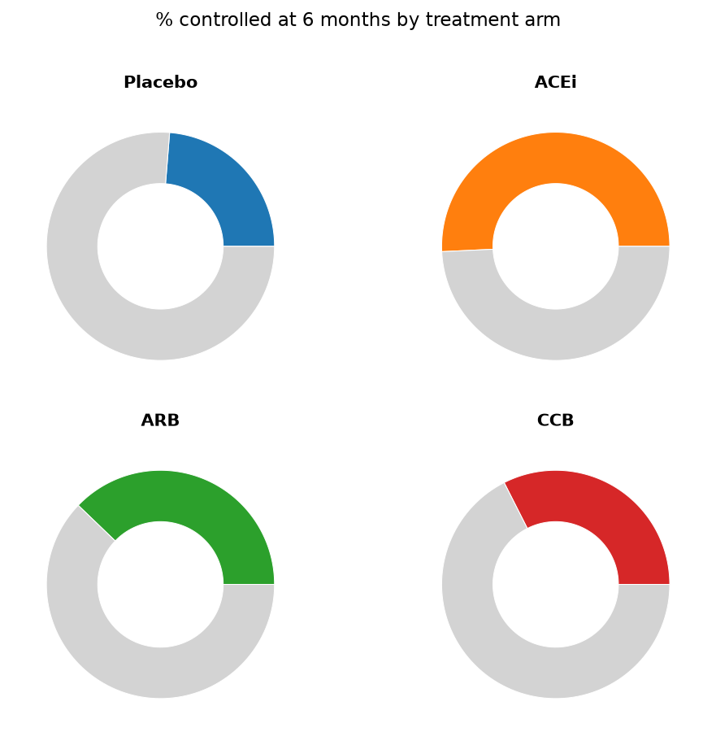{#fig-donut fig-alt="Four donut charts, one per treatment, showing proportion controlled; the four are hard to rank against each other by eye."}

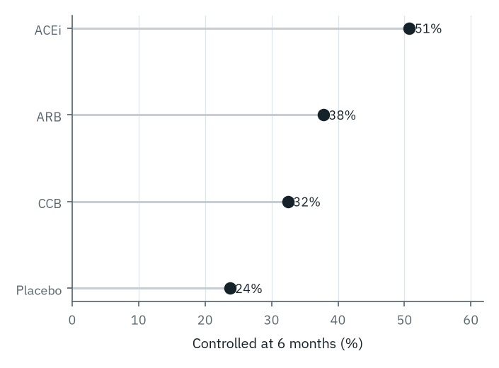{#fig-dotplot fig-alt="A dot plot of the same four proportions on one axis: ACEi highest at 47 percent, then ARB 40, CCB 34, and Placebo lowest at 15; the ranking is immediately clear."}

::: {.callout-note collapse="true"}
## Code

::: {.panel-tabset}

#### R

```r
library(ggplot2); library(dplyr)
source("glauca.R"); library(scales)

ctrl <- cohort |>
  count(treatment, controlled_6m) |>
  group_by(treatment) |>
  mutate(pct = n / sum(n)) |>
  ungroup() |>
  filter(controlled_6m)

ggplot(ctrl, aes(reorder(treatment, pct), pct)) +
  geom_segment(aes(xend = treatment, y = 0, yend = pct),
               colour = "#c8cdd2") +
  geom_point(colour = "#16222a", size = 4.2) +
  geom_text(aes(label = scales::percent(pct, accuracy = 1)),
            hjust = -0.5, family = "IBM Plex Mono", size = 3.4) +
  coord_flip() +
  scale_y_continuous(labels = scales::percent_format(),
                     limits = c(0, 1)) +
  labs(x = NULL, y = "Controlled (%)") +
  theme_glauca()
```

#### Python

```python
import seaborn as sns
import matplotlib.pyplot as plt

ctrl = (cohort.groupby("treatment")["controlled_6m"]
              .mean().reset_index(name="pct")
              .sort_values("pct"))

fig, ax = plt.subplots(figsize=(6.4, 4))
ax.hlines(y=ctrl["treatment"], xmin=0, xmax=ctrl["pct"],
          colors="#B3BBC4")
ax.scatter(ctrl["pct"], ctrl["treatment"],
           color="#009E73", s=140, zorder=3)
for _, r in ctrl.iterrows():
    ax.text(r["pct"] + 0.02, r["treatment"], f'{r["pct"]:.0%}',
            va="center", family="monospace")
ax.set(xlabel="Controlled (%)", ylabel=None, xlim=(0, 1))
sns.despine(); fig.tight_layout()
```

:::

:::

## 5. Dual-axis line chart → small multiples

A second y-axis misleads without technically lying. It invents a relationship by drawing two lines on top of each other; whether the eye reads BMI as "above" or "below" SBP depends entirely on the secondary scale you happened to pick. Two trends that are statistically uncorrelated can be made to look identical, and two that are perfectly correlated can be made to look opposed. Small multiples solve this without effort: each variable gets its own panel and its own axis, and the comparison stays a comparison rather than a coincidence. See @fig-dualaxis and @fig-smallmult.

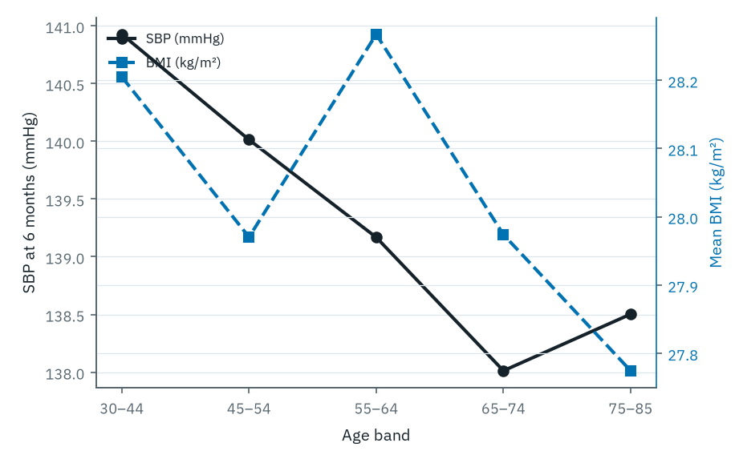{#fig-dualaxis fig-alt="A dual-axis line chart overlaying systolic and BMI by age band on two different y-scales, the two lines appearing to move together."}

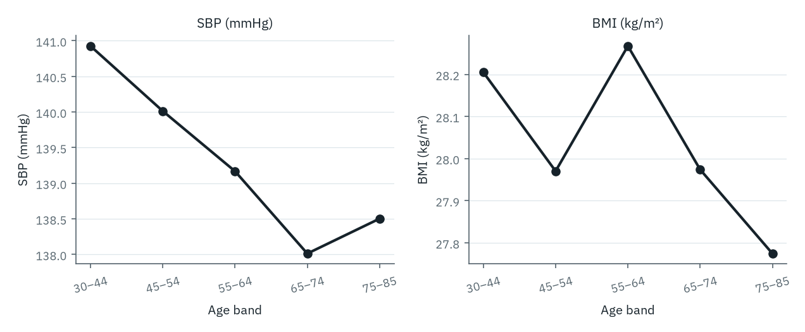{#fig-smallmult fig-alt="The same two series in separate panels with independent y-axes, their trends now clearly different."}

::: {.callout-note collapse="true"}
## Code

::: {.panel-tabset}

#### R

```r
library(ggplot2); library(dplyr)
source("glauca.R"); library(tidyr)

da <- cohort |>
  mutate(age_band = cut(age, c(30,45,55,65,75,85), include.lowest = TRUE,
                        labels = c("30-44","45-54","55-64","65-74","75-85"))) |>
  group_by(age_band) |>
  summarise(SBP = mean(sbp_6m), BMI = mean(bmi), .groups = "drop") |>
  pivot_longer(c(SBP, BMI), names_to = "metric", values_to = "value")

ggplot(da, aes(age_band, value, group = 1)) +
  geom_line(colour = "#16222a", linewidth = 1.1) +
  geom_point(colour = "#16222a", size = 2.4) +
  facet_wrap(~ metric, scales = "free_y") +
  labs(x = "Age band", y = NULL) +
  theme_glauca()
```

#### Python

```python
import seaborn as sns
import matplotlib.pyplot as plt

da = (cohort.assign(
    age_band = pd.cut(cohort["age"], [30,45,55,65,75,85],
                      labels=["30-44","45-54","55-64","65-74","75-85"]))
    .groupby("age_band")[["sbp_6m","bmi"]].mean()
    .reset_index().rename(columns={"sbp_6m":"SBP","bmi":"BMI"})
    .melt(id_vars="age_band", var_name="metric"))

g = sns.relplot(data=da, x="age_band", y="value", col="metric",
                kind="line", marker="o", facet_kws={"sharey": False},
                color="#16222a", height=3.2, aspect=1.0)
g.set_axis_labels("Age band", "")
```

:::

:::

## 6. Mean ± SE bar → distribution

Bar charts of means with error whiskers are the most-criticised chart pattern in modern statistics. They imply a symmetric sampling distribution that often does not exist, hide the sample size, and hide the outliers. Weissgerber and colleagues showed that distinct distributions can produce visually identical bar-and-whisker plots [@weissgerber2015beyond; @motulsky2014misconceptions]. The fix is to show the data: a box plot, a strip plot, a violin, or any combination thereof. A mean is a single number; the distribution is what determines whether that number is informative. @fig-meanbar collapses the four arms into a single statistic; @fig-distribution shows what is actually there.

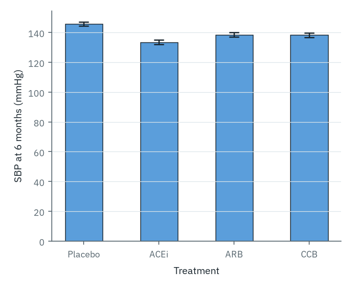{#fig-meanbar fig-alt="A bar chart of mean systolic per treatment with standard-error whiskers, hiding sample size, skew, and outliers."}

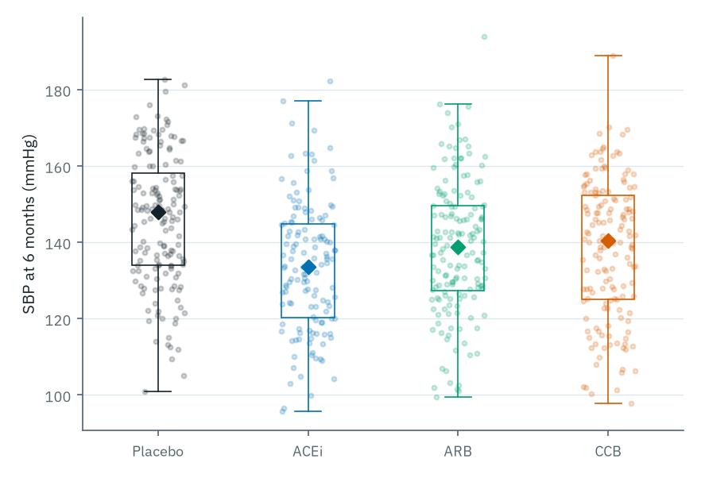{#fig-distribution fig-alt="The same data as boxplots with jittered points and median markers, showing spread, centre, and sample size together."}

::: {.callout-note collapse="true"}
## Code

::: {.panel-tabset}

#### R

```r
library(ggplot2)
source("glauca.R")

ggplot(cohort, aes(treatment, sbp_6m, colour = treatment)) +
  geom_jitter(width = 0.18, alpha = 0.25, size = 1.4) +
  geom_boxplot(width = 0.4, fill = NA, outlier.shape = NA, linewidth = 0.6) +
  stat_summary(fun = median, geom = "point", shape = 18, size = 3.2,
               colour = "black") +
  scale_colour_glauca_d() +
  labs(x = NULL, y = "SBP (mmHg)") +
  theme_glauca() +
  theme(legend.position = "none")
```

#### Python

```python
import seaborn as sns
import matplotlib.pyplot as plt

crew = ["#16222a", "#0072B2", "#009E73", "#D55E00"]

fig, ax = plt.subplots(figsize=(6.4, 4))
sns.stripplot(data=cohort, x="treatment", y="sbp_6m",
              hue="treatment", palette=crew, legend=False,
              alpha=0.25, jitter=0.18, ax=ax)
sns.boxplot(data=cohort, x="treatment", y="sbp_6m",
            hue="treatment", palette=crew, legend=False,
            showfliers=False, fill=False, width=0.4, ax=ax)
ax.set(xlabel=None, ylabel="SBP (mmHg)")
sns.despine(); fig.tight_layout()
```

:::

:::

## 7. Spaghetti longitudinal → small multiples with mean

A spaghetti plot of every patient's trajectory has its uses: it is the right chart when the message is heterogeneity. For showing a treatment effect, it makes the reader work harder than necessary. Faceting the spaghetti by treatment and overlaying the group mean keeps the heterogeneity visible while letting the average do the rhetorical work, as in the move from @fig-spaghetti to @fig-faceted.

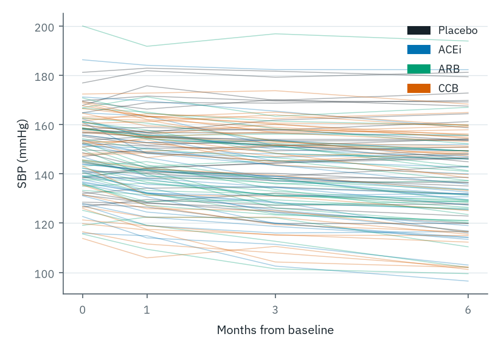{#fig-spaghetti fig-alt="About 120 individual systolic trajectories over time on one panel coloured by treatment, overlapping into an unreadable tangle."}

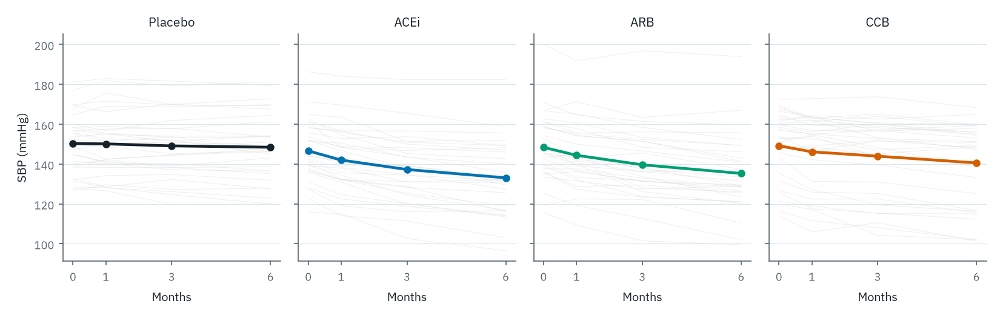{#fig-faceted fig-alt="The same trajectories faceted into one panel per treatment with the group-mean line overlaid, each response shape now legible."}

::: {.callout-note collapse="true"}
## Code

::: {.panel-tabset}

#### R

```r
library(ggplot2); library(dplyr)
source("glauca.R"); library(tidyr)

# `traj` is the long-format cohort with months 0/1/3/6 and SBP per id.
traj_summary <- traj |>
  group_by(treatment, month) |>
  summarise(sbp = mean(sbp), .groups = "drop")

ggplot(mapping = aes(month, sbp)) +
  geom_line(data = traj, aes(group = id),
            colour = "grey70", alpha = 0.35, linewidth = 0.4) +
  geom_line(data = traj_summary,
            aes(group = treatment, colour = treatment), linewidth = 1.4) +
  geom_point(data = traj_summary, aes(colour = treatment), size = 2.4) +
  scale_colour_glauca_d() +
  facet_wrap(~ treatment, nrow = 1) +
  labs(x = "Months from baseline", y = "SBP (mmHg)") +
  theme_glauca() +
  theme(legend.position = "none")
```

#### Python

```python
import seaborn as sns
import matplotlib.pyplot as plt

crew = ["#16222a", "#0072B2", "#009E73", "#D55E00"]

g = sns.FacetGrid(traj, col="treatment", hue="treatment",
                  palette=crew, height=3.2, aspect=1.0,
                  sharey=True)
g.map_dataframe(sns.lineplot, x="month", y="sbp",
                units="id", estimator=None,
                color="lightgrey", alpha=0.35, linewidth=0.5)
g.map_dataframe(sns.lineplot, x="month", y="sbp",
                estimator="mean", linewidth=2.0, marker="o")
g.set_axis_labels("Months from baseline", "SBP (mmHg)")
```

:::

:::

## Practice: classify before you fix

For each figure description below, identify the failure category (ugly / bad / wrong from [principles of data visualisation](10-principles.qmd)) and name the specific pitfall from this chapter.

1. A bar chart where the y-axis runs from 130 to 155 mmHg. The tallest bar appears to be about three times the height of the shortest. The actual difference between the groups is 8 mmHg.

2. A two-panel figure with SBP (scale 0–160 mmHg) on the left axis and body weight (scale 60–100 kg) on the right axis. Both variables trend upward with age band and the two lines look nearly identical on the chart.

3. A pie chart with nine slices: four large ones labelled with category names, and five unlabelled slivers. The legend lists all nine categories.

4. A heatmap of mean blood pressure reduction rendered in `rainbow()`. The yellow band near the middle of the colour scale is visually brighter than the deep values at both ends.

::: {.callout-tip collapse="true"}
## Answer

Suggested answers:

1. **Wrong.** Truncated y-axis (pitfall 3). A bar's length encodes magnitude from zero; starting at 130 inflates the visual difference. The reader sees a ~3× difference; the data show 8 out of ~140 mmHg.

2. **Bad.** Dual-axis chart (pitfall 5). Whether the two lines look similar or opposed depends entirely on the scale chosen for the secondary axis, not on the data.

3. **Bad.** Pie chart with too many categories (pitfall 1). Replace with a sorted horizontal bar chart that shows all nine categories on a common scale.

4. **Ugly/wrong.** Rainbow palette (pitfall 2). Luminance is non-monotonic: yellow (near the middle of the scale) reads as "highest" because it is the brightest, not because the values it represents are the largest.
:::
