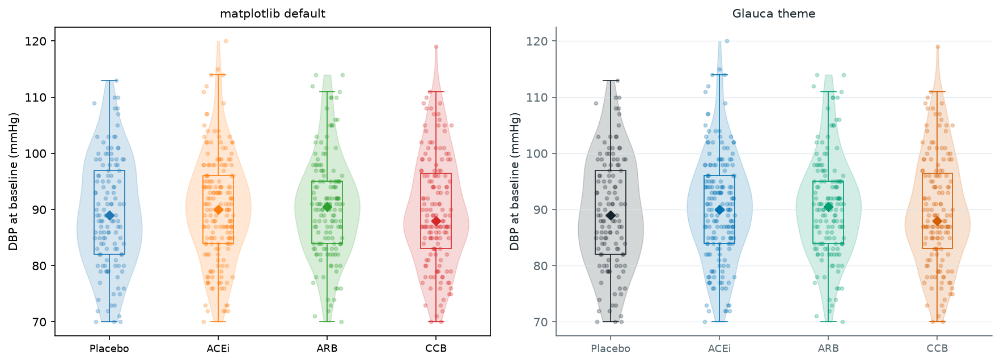

# Colour in figures

::: {.callout-note appearance="simple"}
## Learning objectives
By the end of this chapter you will be able to:

- choose sequential, diverging, and categorical palettes by function
- make figures legible under colour-vision deficiency
- prepare figures (resolution, format, colour space) for submission
:::

Colour is the element of a figure most likely to be discussed in peer review and most likely to fail. A default rainbow palette, a red-green pair that excludes 8% of male readers, or a gradient that looks meaningful but encodes nothing — all are routine in health research and all are avoidable.

Colour encodes meaning: the choice of palette is a claim about the structure of the data: a sequential ramp claims the data have a direction; a diverging scale claims there is a meaningful midpoint; a categorical set claims the groups are unordered. Getting the encoding wrong produces a wrong figure even if the numbers are correct.

## The three functional categories

**Sequential palettes** are for ordered or continuous data: a heatmap of blood pressure by age and BMI, a dot coloured by biomarker level, a map shaded by incidence rate. The key property is monotonic luminance — darker means more (or less), without ambiguity. The viridis family (viridis, magma, plasma, inferno, cividis) is a reliable default for sequential data. All are perceptually uniform, print legibly in greyscale, and pass colour-vision-deficiency checks.

**Diverging palettes** are for data with a meaningful midpoint: change from baseline, a correlation matrix, a z-score heat map. The palette should be symmetric around neutral and run in two distinguishable directions from the centre. Do not use a diverging palette when zero is not meaningful — a positive-only biomarker scale does not have a midpoint.

**Categorical palettes** are for unordered groups: treatment arms, sex at birth, study regions, diagnostic categories. The key property is equal salience — no colour should look like a higher or lower value, and no hue should dominate the eye. Keep the number of categories to eight or fewer; beyond that, group the smallest into "Other" and re-encode by shape or position rather than adding a ninth hue.

## Colour-vision deficiency

Approximately 8% of men and 0.5% of women have some form of colour-vision deficiency [@birch2012diagnosis]. The most common forms — protanopia and deuteranopia — make red and green look similar. Tritanopia, which confuses blue and yellow, is rarer but not negligible.

::: {.column-margin}
Before publishing, run your palette through a CVD simulation. The Colblindor tool accepts any image. In R, `colorBlindness::cvdPlot()` simulates all major types programmatically. Check early: fixing a palette before writing the captions is much less painful than fixing it after the figures are finalised.
:::

Two rules prevent most accessibility failures. First, never rely on colour alone to encode a distinction that carries the result: pair hue with shape, line style, fill pattern, or a direct label. Second, check your palette in simulation before submission, not after review.

## Accessibility beyond colour

Colour is the accessibility failure reviewers name most often, but it is not the only one. Two further checks catch the rest.

**Text size.** Figure text competes with the body text around it, and it is set at the size of the final printed figure, not the size on screen while you draw it. Axis labels, tick labels, and annotations should stay legible when the figure is scaled to its column width. A safe floor is 7 pt for the smallest text at final dimensions; below 5 pt it is unreadable in print. Export at the target width (see [Preparing figures for submission](#preparing-figures-for-submission) below) and read the labels at 100%.

**Alt text.** An online figure needs a text alternative for readers using a screen reader. The caption does not serve: it states the point of the figure, whereas the alt text describes what the figure shows — the chart type, the axes, and the shape of the pattern — so that a reader who cannot see it reaches the same conclusion. One sentence is usually enough: *"Kaplan–Meier curves for two arms; the treated arm separates upward after month two."* In Quarto, set it with the `fig-alt` attribute; most journal submission systems now provide an alt-text field, and leaving it blank is a growing cause of accessibility-desk queries.

## The book's palette

Every figure in this book uses [Glauca](https://github.com/tiagojct/glauca), and its three scales map directly onto the three functional categories above.

**Categorical** is the Okabe-Ito set — seven colours chosen for maximum separation under all three types of colour-vision deficiency, not for brand. Treatment arms, regions, diagnostic groups: `scale_colour_glauca_d()` in R, or the default cycle after `use_glauca()` in Python. Placebo is drawn in ink rather than a hue, so the control reads as a baseline against the coloured active arms.

**Sequential** is a single-hue blue ramp (`glauca_seq`) with even luminance steps: darker means more, without ambiguity. Heatmaps, density ramps, a dot coloured by biomarker level. `scale_fill_glauca_c()` in R, `cmap="glauca_seq"` in matplotlib after `import glauca`.

**Diverging** is a blue-copper ramp with a pale centre (`glauca_div`), for change from baseline or a correlation matrix. The two directions run along the blue-orange axis, the one axis that survives every CVD type.

One identity colour, a sky-blue (`#007AFF`), is kept rare: it marks a single element per figure — a regression line, a highlighted series — never the whole palette. Magnitude scales encode value, so the brand hue is free there; a categorical figure gets Okabe-Ito, not seven shades of blue. The style files are vendored at [`figures/glauca.py`](https://github.com/tiagojct/working-draft/blob/main/figures/glauca.py) and [`figures/glauca.R`](https://github.com/tiagojct/working-draft/blob/main/figures/glauca.R).

## Preparing figures for submission

Journal specifications for figures are more demanding than most researchers expect. A figure that looks fine on a monitor at 72 ppi will print blurred at journal resolution, and a figure submitted in the wrong colour space will reproduce differently in print than on screen. Check the target journal's figure guidelines before finalising.

**Resolution.** Print journals require 300 dots per inch (dpi) at the figure's final printed dimensions. For a single-column figure (~86 mm wide in most journals), that means at least 1,020 pixels wide; for a double-column figure (~178 mm), at least 2,102 pixels. Figures containing fine lines, text, or points need higher resolution — 600 dpi is common for combination artwork (panels with both photographs and line art). Raster figures (PNG, TIFF) embedded in Word documents are often compressed on saving; export directly from your plotting environment at the target resolution rather than inserting into a document first.

**File formats.** For line art (charts, graphs, diagrams with no photographs), prefer **vector formats** — PDF or SVG — because they scale without loss and embed fonts cleanly. For figures containing raster elements (photographs, confocal images), use **TIFF** for print submission; it is lossless and universally accepted. **PNG** is appropriate for web-only output and for preprints. **JPEG** uses lossy compression that introduces artefacts around sharp edges (text labels, data points) and should be avoided for scientific figures. If the journal's submission system requires a specific format, use it; if it accepts multiple formats, prefer PDF for purely graphical output.

::: {.column-margin}
In R, `ggsave("figure1.pdf", width = 86, height = 70, units = "mm")` exports a single-column figure as a vector PDF. For TIFF at 300 dpi: `ggsave("figure1.tiff", width = 86, height = 70, units = "mm", dpi = 300)`. In Python / matplotlib: `fig.savefig("figure1.pdf", bbox_inches="tight")` or `fig.savefig("figure1.tiff", dpi=300, bbox_inches="tight")`.
:::

**Colour space.** Digital displays use RGB (red-green-blue); commercial printing uses CMYK (cyan-magenta-yellow-black). An RGB figure sent to a print journal may shift in colour when converted by the production team. For journals that handle print production (most society journals and high-impact weeklies), ask whether to submit RGB or CMYK, or whether they handle the conversion. For online-only journals, RGB is correct. Most R and Python plotting libraries output RGB by default; CMYK conversion requires a post-processing step (e.g., Inkscape, Acrobat, or `colorspace::writePDF()` in R).

**Font embedding.** Any text in the figure — axis labels, tick marks, legends, annotations — must use fonts that are either embedded in the file or replaced with paths. A figure that uses a system font not installed on the production server will display incorrectly. The safest approach is to export as PDF with embedded fonts (the default in R's PDF device and in matplotlib's PDF backend) or to convert text to outlines in a vector editor before submission.

## Theme showcase

A theme is not just a colour palette — it is the complete visual vocabulary of a figure: background, grid, spine style, text colour, and typeface working together. The same data drawn with different defaults will look like different papers, even if the geometry and the numbers are identical.

@fig-theme-comparison shows the same layered distribution plot (DBP at baseline by treatment arm) drawn twice: on the left with matplotlib's out-of-the-box defaults (a boxed frame, the tab10 colour cycle, no considered typography); on the right with the Glauca theme (a pale ground, Okabe-Ito arms, IBM Plex, spines and grid pared back). The geometry and the numbers are identical. The difference is entirely vocabulary, and it is the difference between a figure that looks provisional and one that looks published.

{#fig-theme-comparison fig-alt="The same layered distribution plot side by side: left in matplotlib's boxed default style with the tab10 palette, right in the Glauca theme with a pale ground, Okabe-Ito arm colours, IBM Plex type, and pared-back spines."}

::: {.callout-note collapse="true"}
## Theme setup code

::: {.panel-tabset}

#### Python

```python
import seaborn as sns
import matplotlib.pyplot as plt
from glauca import use_glauca, GLAUCA_CATEGORICAL

use_glauca("light")            # IBM Plex, pale ground, Okabe-Ito cycle

arms = ["Placebo", "ACEi", "ARB", "CCB"]
pal  = {"Placebo": "#16222a", **dict(zip(arms[1:], GLAUCA_CATEGORICAL))}

fig, ax = plt.subplots(figsize=(6.5, 4.0))
sns.violinplot(data=cohort, x="treatment", y="dbp_baseline",
               hue="treatment", palette=pal, legend=False,
               fill=False, linewidth=0.6, ax=ax)
sns.stripplot(data=cohort, x="treatment", y="dbp_baseline",
              hue="treatment", palette=pal, legend=False,
              alpha=0.25, jitter=True, size=3, ax=ax)
ax.set(xlabel=None, ylabel="DBP at baseline (mmHg)")
sns.despine(); fig.tight_layout()
```

#### R

```r
library(ggplot2)
source("glauca.R")             # theme_glauca(), scale_*_glauca_d()

ggplot(cohort, aes(treatment, dbp_baseline, colour = treatment, fill = treatment)) +
  geom_violin(alpha = 0.18, linewidth = 0.4) +
  geom_jitter(width = 0.16, alpha = 0.30, size = 1.3) +
  geom_boxplot(width = 0.18, fill = NA, outlier.shape = NA, linewidth = 0.5) +
  scale_colour_glauca_d() +
  scale_fill_glauca_d() +
  labs(x = NULL, y = "DBP at baseline (mmHg)") +
  theme_glauca()
```

:::
:::
