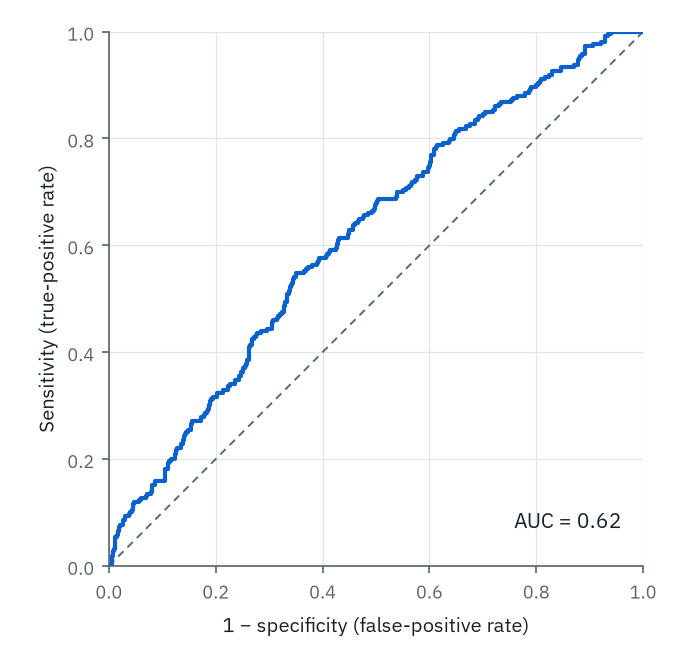
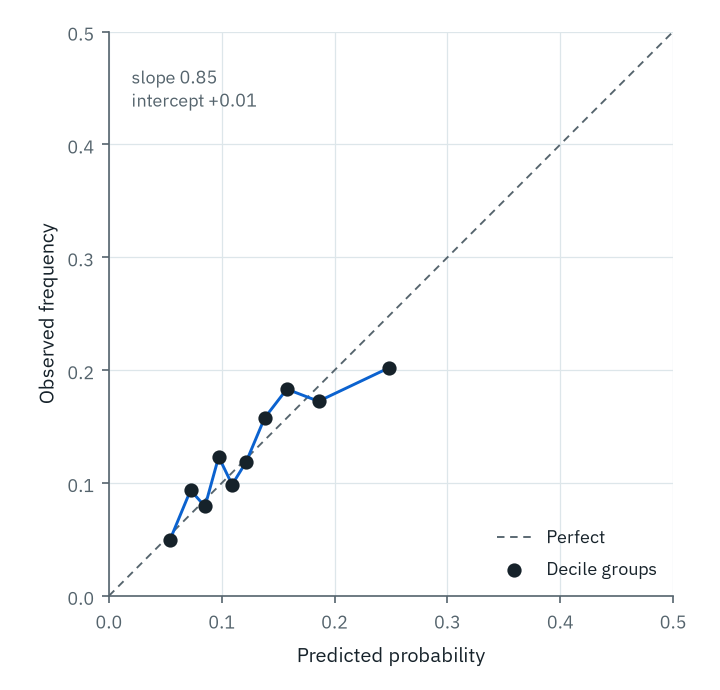
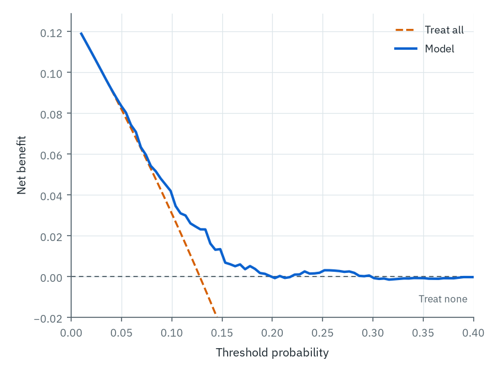

# Reporting a prediction model

A prediction model earns a different reporting standard because it makes a different kind of claim. A cohort study says *this exposure is associated with this outcome*. A prediction model says *give me these inputs for a new patient and I will return a probability you can act on*. The second claim is only worth anything if the model has been shown to work on patients who were not used to build it, and if the paper reports enough for a reader to judge whether it will work on theirs. STROBE was not written for that. TRIPOD+AI was [@collins2024tripod], and it applies whether the model is a logistic regression or a gradient-boosted ensemble.

This chapter reports one worked model to that standard: a model for 30-day readmission after acute heart failure, built on the Part I cohort. Three numbers decide whether it is any good, and a paper that reports one of them and hides the other two is the most common failure in this literature.

## Development and validation are different studies

Report them as such. The model here was **developed** on a random 60% of the cohort (3,038 patients) and **validated** on the held-out 40% (2,027 patients) that played no part in fitting. Every performance number below is the validation number, because the development numbers are optimistic by construction: a model always fits the data it was trained on better than it fits anything else.

A held-out split is the weakest form of validation and the one to use only when nothing better is available. Internal validation by bootstrapping or cross-validation uses the data more efficiently and yields an optimism-corrected estimate. **External** validation (a different hospital, a later time period, a different country) is what a reader wants, because it is the only evidence that the model survives the distribution shift it will meet in use. State which one you did, in the title if it is the point of the paper: *"development and internal validation"* and *"external validation"* are different studies and TRIPOD+AI asks you to say which.

## Discrimination: can the model rank?

Discrimination is the model's ability to give higher probabilities to patients who have the event than to those who do not. The summary is the area under the ROC curve (@fig-pred-roc), equal to the c-statistic (Chapter: statistical writing, on diagnostic accuracy). Here it is 0.62 on validation, down from 0.64 on development: modest, and honestly so.

{#fig-pred-roc fig-alt="A receiver-operating-characteristic curve rising above the 45-degree diagonal, with an annotated area under the curve of 0.62."}

Discrimination is where most papers stop, and it is the least actionable of the three numbers. A c-statistic of 0.62 tells you the model ranks a random readmitted patient above a random non-readmitted one 62% of the time. It does not tell you whether the probability the model prints is *true*: whether "20% risk" happens to one in five of the patients who get it. That is calibration, and a model can discriminate acceptably while being badly enough calibrated to be dangerous.

## Calibration: are the probabilities true?

Calibration is the agreement between predicted probabilities and observed frequencies, and it is the axis most often omitted and most consequential when it fails [@vancalster2019calibration]. Plot it (@fig-pred-cal): group patients by predicted risk, and plot observed event frequency against mean predicted probability in each group. Perfect calibration lies on the diagonal.

{#fig-pred-cal fig-alt="A calibration plot: ten decile points of observed versus predicted probability lie close to the 45-degree perfect-calibration line, drifting slightly below it at the highest predicted risks."}

Report two numbers, not just the picture. **Calibration-in-the-large** is the agreement between mean predicted risk and overall event rate; here +0.01 on the log-odds scale, meaning the model's average prediction (12.7%) matches the observed rate (12.8%). **Calibration slope** measures whether the predictions are too extreme; here 0.85, below the ideal of 1.0, the signature of mild overfitting: the model's high risks are a little too high and its low risks a little too low, visible as the top decile sitting below the line. A slope well under 1 is the reason a model developed in one setting prints implausible probabilities in another, and it is invisible on an ROC curve.

## Clinical usefulness: is acting on it better than not?

Discrimination and calibration are properties of the probabilities. Whether the model *helps* depends on what you do with them and at what threshold. Decision-curve analysis answers that directly [@vickers2006decision]: across a range of threshold probabilities (the risk at which a clinician would act), it plots the model's **net benefit** against two default strategies, treat everyone and treat no one (@fig-pred-dca).

{#fig-pred-dca fig-alt="A decision-curve plot: the model's net-benefit line stays at or above the treat-all diagonal and the treat-none horizontal across threshold probabilities from about 5 to 30 percent."}

The model is worth using only where its curve is above both defaults. Here it beats *treat all* once the acting threshold exceeds roughly 7% and stays above *treat none* to about 20%. So for a clinician who would intervene on a patient at, say, 15% readmission risk, the model adds net benefit; for one who would act only above 30%, it does not, and the honest report says so. A decision curve turns an abstract c-statistic into the question a reader has: at my threshold, is this model better than the blunt alternatives?

::: {.callout-note collapse="true"}
## Code

Computed with the vendored Glauca style ([`figures/predmodel.py`](https://github.com/tiagojct/working-draft/blob/main/figures/predmodel.py)). The core is a logistic fit, then the three performance views.

```python
import numpy as np, pandas as pd, statsmodels.formula.api as smf
from sklearn.metrics import roc_auc_score

d = pd.read_csv("figures/sw/cohort.csv").dropna(subset=["ntprobnp_discharge"])
d = d.assign(lognt=np.log(d.ntprobnp_discharge / 1000),
             male=(d.sex == "M").astype(int), y=d.readmit_30d.astype(int))
dev, val = d.sample(frac=0.6, random_state=1), d.drop(d.sample(frac=0.6, random_state=1).index)

f = "y ~ lognt + age + male + lvef + egfr + prior_hf_admit + afib + C(nyha_admission)"
fit = smf.logit(f, data=dev).fit()
val = val.assign(p=fit.predict(val))

# discrimination
auc = roc_auc_score(val.y, val.p)

# calibration slope (logistic recalibration of the outcome on the linear predictor)
val = val.assign(lp=np.log(val.p / (1 - val.p)))
slope = smf.logit("y ~ lp", data=val).fit().params["lp"]

# net benefit at threshold t: TP/n - FP/n * t/(1-t)
def net_benefit(y, p, t):
    pred = p >= t
    return (np.sum(pred & (y == 1)) - np.sum(pred & (y == 0)) * t / (1 - t)) / len(y)
```

In R the parallels are `pROC::auc()`, `rms::val.prob()` for the calibration slope and intercept, and `dcurves::dca()` for the decision curve.
:::

## The reporting text

TRIPOD+AI is a checklist; the paper is prose. Two paragraphs carry most of the model's performance, and they must name development and validation separately and report all three axes.

**Methods.**

> *"We developed a logistic-regression model for 30-day unplanned readmission using eight pre-specified predictors available at discharge (NT-proBNP [log-transformed], age, sex, LVEF, eGFR, prior heart-failure admission, atrial fibrillation, and NYHA class). The model was fitted on a randomly selected 60% of the cohort (development set, n = 3,038) and evaluated on the held-out 40% (validation set, n = 2,027). Performance was assessed by discrimination (c-statistic), calibration (calibration plot, calibration slope, and calibration-in-the-large), and clinical usefulness (decision-curve analysis across threshold probabilities of 5–30%). No predictor selection was performed after seeing the outcome; the model was pre-specified [@collins2024tripod; @steyerberg2010assessing]."*

**Results.**

> *"On validation, the model discriminated modestly (c-statistic 0.62; development 0.64). Calibration was good in the large (mean predicted risk 12.7% vs observed 12.8%) with a calibration slope of 0.85, indicating mild overfitting of the development estimates. Decision-curve analysis showed net benefit over both treat-all and treat-none strategies across threshold probabilities of approximately 7–20%. The model has not been externally validated; its transportability to other settings is unknown."*

Three things this reporting does that a discrimination-only report does not: it separates development from validation performance, it reports calibration (both numbers, not just a claim that it was "adequate"), and it states the limit of the evidence in the same breath as the result. For a reader deciding whether to use the model, that last sentence is the one that matters most: it says where the evidence stops.

::: {.callout-note}
The c-statistic here (0.62) is computed from the committed cohort and is deliberately modest, to make the point that calibration and net benefit still matter when discrimination is unremarkable. It is a different, lower number from the illustrative c-statistic of 0.71 used as a rounded teaching value in the statistical-writing chapter's diagnostic-accuracy template; the two are not the same worked model.
:::

## Practice: what is missing from this report?

A colleague sends you the results paragraph below for a readmission model. Name the three reporting failures before revealing the answer.

> *"Our machine-learning model predicted 30-day readmission with an AUC of 0.81 (95% CI 0.78–0.84), outperforming the clinical baseline. The model is available on request."*

::: {.callout-tip collapse="true"}
## Answer

1. **No validation statement.** An AUC of 0.81 with no mention of a held-out set, cross-validation, or external cohort is almost certainly the apparent (development) performance, optimistic and uninformative about new patients. "Outperforming the clinical baseline" on the same data it was trained on is not evidence.
2. **No calibration.** Discrimination is reported and calibration is absent, so the reader cannot tell whether the probabilities are true. A well-discriminating, badly-calibrated model prints confident wrong risks.
3. **No clinical usefulness and no usable model.** There is no threshold analysis or decision curve, so "outperforming" is undefined in decision terms; and "available on request" (Chapter: open science) means the model itself cannot be examined, reproduced, or applied. TRIPOD+AI asks for the full model equation or the code.
:::
